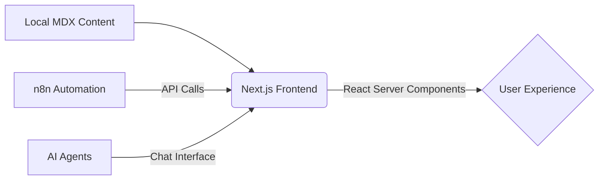

# Ai Automation & Business Consultancy for saas, agencies & small business | whoisalfaz.me


> **"Control. Connect. Conquer."**  
> The central nervous system for my digital existence. A high-performance, headless architecture designed to showcase the future of automation, AI, and faceless business systems.

## 🚀 Mission

I help agency owners and entrepreneurs escape the **"Content Treadmill"** and build systems that run on autopilot. This repository (`whoisalfaz-v2`) is the frontend for my personal brand, serving as both a portfolio and a laboratory for my experiments in **AI Agents**, **n8n workflows**, and **CashOps**.

---

## 🏗 Purely Decoupled Architecture

This project is now a high-performance headless architecture using **Local MDX** for content and **Next.js** for the frontend, ensuring maximum security and zero external dependencies on a CMS.



### 1. The Brain (Content)
- **Source**: Local MDX Files (`content/blog/`)
- **Metadata**: YAML Frontmatter
- **Role**: Manages blog posts, series progression, and technical documentation with full version control parity.

### 2. The Face (Frontend)
- **Framework**: Next.js 15 (App Router)
- **Styling**: Tailwind CSS + Custom Design System (Dark Mode / Glassmorphism)
- **Deployment**: Dual-Remote Pipeline (GitHub + DigitalOcean)
- **Role**: Renders the UI, manages routing, and hosts interactive tools (ROI Calculator, AI Chat).

---

## 🛠 Tech Stack

| Component | Technology | Purpose |
| :--- | :--- | :--- |
| **Frontend** | **Next.js 15** | Server-Side Rendering (SSR) & Static Generation |
| **UI/UX** | **Tailwind CSS** | Utility-first styling with "Cyberpunk" aesthetic |
| **Languages** | **JavaScript / React** | Core logic and interactive components |
| **Backend** | **WordPress + GraphQL** | Headless CMS for Blog & Pages |
| **Logic** | **n8n / Node.js** | Backend automation Workflows |
| **Security** | **xss** | Cross-Site Scripting protection for dynamic content |
| **Analytics** | **Vercel Analytics** | Performance tracking |

---

## 🔬 Key Features (Labs)

### 🤖 AI Chat Interface (`/labs/chat`)
A custom-built chat interface mimicking an AI Agen.
- **Rule-Based Logic**: Responds to keywords (Pricing, Tech Stack, Contact).
- **UI**: Streaming text effect, auto-scroll, and "Thinking" states.

### 💰 ROI Calculator (`/labs/roi`)
Interactive tool for agencies to estimate automation savings.
- **Real-time Math**: Instant calculation based on employee count & hours saved.
- **Visuals**: Dynamic progress bars and result cards.

### 📝 Tech Magazine Blog (`/blog`)
A fully custom blog engine.
- **Premium Layout**: 2-Column "Magazine" style with Sticky TOC.
- **Deep Deep**: Terminal-style code blocks and rich typography.

### 🔍 Website Audit Engine (`/audit`)
A proprietary technical SEO and performance auditing system.
- **Deep Analysis**: Scans SSL health, Meta/OG tag compliance, Security Headers, Robots/Sitemap structure, and DNS latency.
- **PageSpeed Integration**: Leverages Google PageSpeed Insights API for real-time Performance and Core Web Vitals scoring.
- **UX-First**: Features intelligent URL normalization (automatically handles missing protocols) and a "waiting-substantive" animation lifecycle.
- **Security**: Zero hardcoded API keys; strictly utilizes environment variables for all external integrations.

---

## 📦 Deployment Protocol

This project uses a custom **Dual-Push** pipeline to ensure redundancy.

**Command:**
```bash
npm run push-all
```
*Effect*: Pushes code to both `origin` (GitHub backup) and `deploy` (Live DigitalOcean server) simultaneously.

---

## 💻 Running Locally

1.  **Clone the Repo**
    ```bash
    git clone https://github.com/AlfazMahmudRizve/whoisalfaz-v2.git
    cd whoisalfaz-v2
    ```

2.  **Install Dependencies**
    ```bash
    npm install
    ```

3.  **Configure Environment**
    Create a `.env.local` file (Contact me for API keys).

4.  **Launch**
    ```bash
    npm run dev
    ```
    Visit `http://localhost:3000`.

---

**Built by Alfaz Mahmud Rizve**  
*Building the future of work, one workflow at a time.*
