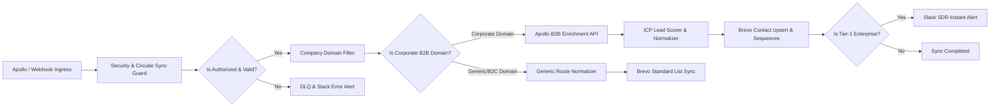
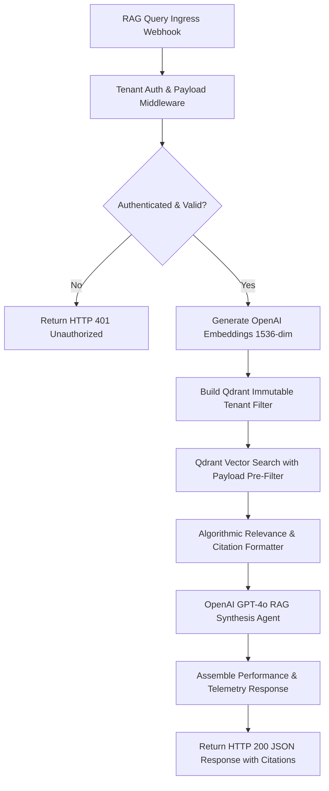
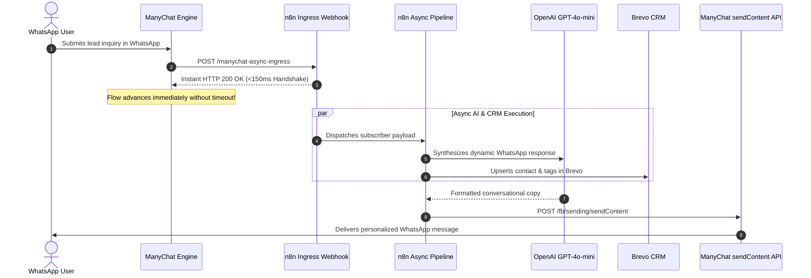

# ⚡ Production-Ready n8n Community Templates & Blueprints

[](https://n8n.io)
[](https://opensource.org/licenses/MIT)
[](https://whoisalfaz.me)
[](https://whoisalfaz.me/services/n8n-automation/)

Welcome to the official **n8n Community Workflow & Ecosystem Package** curated and engineered by **[Alfaz Mahmud Rizve](https://whoisalfaz.me)**, Founder & Principal Automation Architect at **Accelerated Growth Studio**.

This repository contains battle-tested, enterprise-grade n8n workflow blueprints designed to eliminate manual RevOps bottlenecks, guarantee data isolation in multi-tenant RAG systems, and solve real-world timeout constraints across modern marketing stacks.

---

## 📑 Workflow Catalog

| Blueprint File | Workflow Name | Official n8n Hub URL | Core Integrations | Key Technical Highlights |
| :--- | :--- | :---: | :--- | :--- |
| [`apollo-to-brevo-enrichment-pipeline.json`](file:///e:/Ai%20Agents/whoisalfaz.me/Web%20Projects/antigravity/whoisalfaz-v2/ecosystem/n8n-templates/apollo-to-brevo-enrichment-pipeline.json) | **Apollo to Brevo B2B Enrichment Pipeline** | [n8n.io/workflows/18609](https://n8n.io/workflows/18609) | Apollo.io, Brevo, Slack, n8n Webhook | Circular sync guard, HMAC validation, company domain classifier, 4-tier ICP scoring, DLQ error catch. |
| [`qdrant-multi-tenant-rag-engine.json`](file:///e:/Ai%20Agents/whoisalfaz.me/Web%20Projects/antigravity/whoisalfaz-v2/ecosystem/n8n-templates/qdrant-multi-tenant-rag-engine.json) | **Qdrant Multi-Tenant RAG Engine** | [n8n.io/workflows/18617](https://n8n.io/workflows/18617) | Qdrant Vector DB, OpenAI Embeddings, GPT-4o | Strict tenant authentication middleware, payload metadata pre-filtering, similarity gating, citation synthesis. |
| [`manychat-async-timeout-handler.json`](file:///e:/Ai%20Agents/whoisalfaz.me/Web%20Projects/antigravity/whoisalfaz-v2/ecosystem/n8n-templates/manychat-async-timeout-handler.json) | **ManyChat Async Timeout Handler** | [n8n.io/workflows/18500](https://n8n.io/workflows/18500-handle-manychat-whatsapp-leads-with-openai-brevo-crm-and-slack-alerts/) | ManyChat API, WhatsApp, Brevo CRM, OpenAI | <150ms HTTP 200 handshake to bypass ManyChat 10s timeout, background async lead scoring, CRM upsert, AI copy generation. |

---

## 1. 🚀 Apollo to Brevo Enrichment Pipeline (`apollo-to-brevo-enrichment-pipeline.json`)

### 📌 Overview & Business Value
Manual prospect enrichment and dirty email ingestion severely degrade sender reputation, waste SDR hours, and inflate customer acquisition costs. This production pipeline captures incoming leads via webhook, validates corporate authenticity, enriches company and decision-maker metadata via Apollo.io, calculates a deterministic ICP score, and synchronizes pristine contact attributes into Brevo CRM sequences.



### ⚙️ Key Technical Features
1. **Circular Sync Guardrail**: Checks `AUTOMATION_ORIGIN` attribute to prevent infinite automation loops between Apollo, n8n, and Brevo.
2. **HMAC SHA-256 Webhook Verification**: Cryptographically validates incoming webhook signatures using `crypto.createHmac`.
3. **Corporate Domain Classification**: Evaluates email addresses against a 15+ provider generic/free email blacklist (`gmail.com`, `yahoo.com`, `outlook.com`, etc.) to conserve Apollo API credits on non-commercial submissions.
4. **Algorithmic ICP Lead Scoring**:
   - **Seniority & Title** (C-Suite / Founder: +40 pts, VP: +30 pts, Director: +20 pts, Manager: +10 pts)
   - **Company Headcount** (50–1,000 employees: +30 pts, 1,000+: +25 pts, 10–49: +15 pts)
   - **Industry Alignment** (SaaS, FinTech, IT, Marketing: +20 pts)
   - **Data Completeness** (LinkedIn profile: +10 pts)
5. **Brevo Dynamic List Assignment**: Routes Tier 1 (70+ score) to high-touch outbound sequences, Tier 2 (45–69) to nurture campaigns, and Tier 3 (<45) to standard newsletter pools.
6. **Dead-Letter Queue (DLQ)**: Traps network and API exceptions into a DLQ buffer and pushes real-time incident notifications to Slack.

### 🔑 Environment Variables & Credentials
| Variable Name | Description | Example Value |
| :--- | :--- | :--- |
| `APOLLO_API_KEY` | Apollo.io API Key for People Match & Enrichment | `api_key_live_...` |
| `APOLLO_WEBHOOK_SECRET` | Secret token to verify incoming webhook signatures | `whsec_apollo_secret_998` |
| `BREVO_API_KEY` | Brevo (Sendinblue) API v3 Key with contact write permissions | `xkeysib-...` |
| `BREVO_TIER_1_LIST_ID` | Brevo List ID for Enterprise Outbound Sequence | `101` |
| `BREVO_TIER_2_LIST_ID` | Brevo List ID for Mid-Market Nurture Sequence | `102` |
| `BREVO_STANDARD_LIST_ID` | Brevo List ID for General/B2C Leads | `103` |
| `SLACK_WEBHOOK_URL` | Slack Incoming Webhook for Tier-1 alerts and DLQ errors | `https://hooks.slack.com/services/...` |

---

## 2. 🛡️ Qdrant Multi-Tenant RAG Engine (`qdrant-multi-tenant-rag-engine.json`)

### 📌 Overview & Architecture
Deploying enterprise retrieval-augmented generation (RAG) across multiple clients or internal departments demands strict data isolation. Creating separate vector collections per client causes severe RAM inflation due to redundant HNSW graph indexing.

This blueprint implements **Payload-Filtered Multi-Tenancy** inside a single optimized Qdrant collection, enforcing database-level pre-filtering by `tenant_id` and `workspace_id`.



### ⚙️ Key Technical Features
1. **Tenant Authentication Middleware**: Validates `x-tenant-id` and `x-workspace-id` headers, rejecting unauthenticated or malformed requests with strict HTTP 401/400 errors.
2. **Immutable Pre-Filtering**: Constructs a Qdrant `filter.must` clause that limits nearest-neighbor vector similarity strictly within the client's partition before calculating distance metrics.
3. **Relevance Scoring Gate**: Filters out document chunks failing the minimum cosine similarity threshold (default `0.68`), preventing low-relevance noise from polluting the LLM context window.
4. **Strict Zero-Hallucination Grounding Prompt**: Enforces strict adherence to internal verified documentation chunks and requires explicit bracketed citations (`[Source 1]`, `[Source 2]`).
5. **Full Execution Telemetry**: Returns prompt tokens, completion tokens, average vector similarity, citation sources, and execution timestamp in standard JSON format.

### 🔑 Environment Variables & Credentials
| Variable Name | Description | Example Value |
| :--- | :--- | :--- |
| `QDRANT_HOST` | URL of self-hosted Qdrant Docker or Qdrant Cloud | `http://qdrant.internal:6333` |
| `QDRANT_API_KEY` | API Key for Qdrant cluster authentication | `qd_live_secret_key...` |
| `QDRANT_COLLECTION` | Target Qdrant vector collection name | `enterprise_rag_vectors` |
| `OPENAI_API_KEY` | OpenAI API Key for embeddings and GPT-4o synthesis | `sk-proj-...` |

---

## 3. ⚡ ManyChat Async Timeout Handler (`manychat-async-timeout-handler.json`)

### 📌 Overview & Handshake Architecture
ManyChat enforces a hard **10-second timeout ceiling** on external webhook actions. Complex AI agent chains, CRM upserts, and enrichment lookups often exceed 10 seconds, causing ManyChat steps to fail and breaking the conversational funnel.

This workflow implements an **Instant HTTP 200 Handshake Pattern**: n8n returns an immediate 200 OK response within **150ms** to satisfy ManyChat's timeout engine, then continues async background processing and pushes the completed conversational response back to WhatsApp via the ManyChat Callback API.



### ⚙️ Key Technical Features
1. **Sub-150ms HTTP 200 Handshake**: Utilizes n8n's `Respond to Webhook` node configured for immediate response, releasing the ManyChat connection while keeping downstream execution active.
2. **Dynamic Lead Scoring**: Calculates lead readiness based on budget brackets, implementation timeline, contact details, and core interest.
3. **Parallel CRM Upsert & AI Generation**: Dispatches Brevo contact synchronization and OpenAI GPT-4o-mini message synthesis concurrently to maximize throughput.
4. **ManyChat WhatsApp Callback API**: Pushes formatted rich text messages directly back to the subscriber's active WhatsApp chat thread using `subscriber_id`.
5. **Hot Lead Slack Escalation**: Automatically alerts human SDRs with clickable `wa.me` links when inbound leads score >= 70 points.

### 🔑 Environment Variables & Credentials
| Variable Name | Description | Example Value |
| :--- | :--- | :--- |
| `MANYCHAT_API_KEY` | ManyChat Access Token for `sendContent` API | `Bearer 123456:abc...` |
| `OPENAI_API_KEY` | OpenAI API Key for GPT-4o-mini copywriting | `sk-proj-...` |
| `BREVO_API_KEY` | Brevo CRM Key for contact upsert & lead tags | `xkeysib-...` |
| `SLACK_WEBHOOK_URL` | Slack Incoming Webhook for instant hot lead alerts | `https://hooks.slack.com/services/...` |

---

## 🛠️ Step-by-Step Import & Deployment SOP

### 1. Import Workflow Blueprint into n8n
1. Open your self-hosted or cloud **n8n instance** (v1.0+).
2. Click the **`+ Add Workflow`** button or the top-right menu (three dots `⋮`).
3. Select **`Import from File`** and choose the desired `.json` template from this folder.

### 2. Configure Environment Variables
Set your environment variables in your server's `.env` file or n8n Environment Configuration:
```bash
# Core API Credentials
APOLLO_API_KEY="your_apollo_api_key"
APOLLO_WEBHOOK_SECRET="your_webhook_secret"
BREVO_API_KEY="your_brevo_api_key"
OPENAI_API_KEY="your_openai_api_key"
QDRANT_HOST="http://localhost:6333"
QDRANT_API_KEY="your_qdrant_key"
MANYCHAT_API_KEY="your_manychat_token"
SLACK_WEBHOOK_URL="https://hooks.slack.com/services/..."
```

### 3. Verify Canvas Nodes
- Click any node displaying a warning icon to verify that credential references map correctly.
- Review the colored **Sticky Note SOP** positioned above each workflow for step-specific testing instructions.
- Toggle the workflow status in the top right to **`Active`**.

---

## 🌐 Official n8n Community Template Submission Guidelines

If you are preparing workflows for submission to the **[n8n Workflow Creator Community](https://n8n.io/workflows)**, adhere strictly to these architectural quality standards:

### 📋 Quality & Compliance Checklist
- [x] **Zero Pinned Data**: Never export workflows containing production or test execution payloads. Ensure `pinData` objects are completely emptied.
- [x] **Credential Abstraction**: Replace private credentials with standard environment variables (`$env.VARIABLE_NAME`) or generic credential placeholders (`YOUR_API_KEY_HERE`).
- [x] **Sticky Note SOPs**: Include a prominent, color-coded Sticky Note (`n8n-nodes-base.sticky`) detailing setup prerequisites, environment variable definitions, testing procedures, and author attribution.
- [x] **Action-Oriented Node Naming**: Label all nodes with descriptive, business-logic titles (e.g., `Verify Webhook Signature`, `Build Qdrant Tenant Filter`) rather than default generic names like `HTTP Request 1` or `Code 2`.
- [x] **Standard Grid Layout**: Organize nodes along clean horizontal execution axes with 240–260px spacing for optimal visual clarity.
- [x] **Error Trapping**: Implement `onError: continueErrorOutput` and dedicated Dead-Letter Queue (DLQ) handlers for resilient error containment.

### 🚀 How to Submit to the n8n Creator Community
1. Export your sanitized workflow JSON (`Export > Download Workflow`).
2. Visit the **[n8n Community Creator Hub](https://n8n.io/workflows)**.
3. Click **`Submit a Workflow`** and paste your sanitized JSON blueprint.
4. Add descriptive documentation, setup instructions, and link your author portfolio: `https://whoisalfaz.me`.

---

## 👨‍💻 About the Author & Commercial Implementation

These templates are maintained and engineered by **Alfaz Mahmud Rizve**, Founder of **Accelerated Growth Studio**.

We architect and scale end-to-end RevOps automation, self-hosted AI vector infrastructure, and omnichannel conversational pipelines for high-growth B2B SaaS companies and agencies.

### 💼 Services & Custom Builds:
- 🛠️ **Custom n8n Workflow Engineering**: [whoisalfaz.me/services/n8n-automation](https://whoisalfaz.me/services/n8n-automation/)
- 📈 **Growth Architecture & RevOps Consulting**: [whoisalfaz.me/services/growth-consulting](https://whoisalfaz.me/services/growth-consulting/)
- 📬 **Book a Technical Consultation**: [whoisalfaz.me/contact](https://whoisalfaz.me/contact/)
- 🌐 **Full Portfolio & Case Studies**: [whoisalfaz.me](https://whoisalfaz.me)

---

### 📄 License
This repository and its workflow templates are released under the [MIT License](https://opensource.org/licenses/MIT). You are free to adapt, customize, and deploy them in commercial and private environments.
