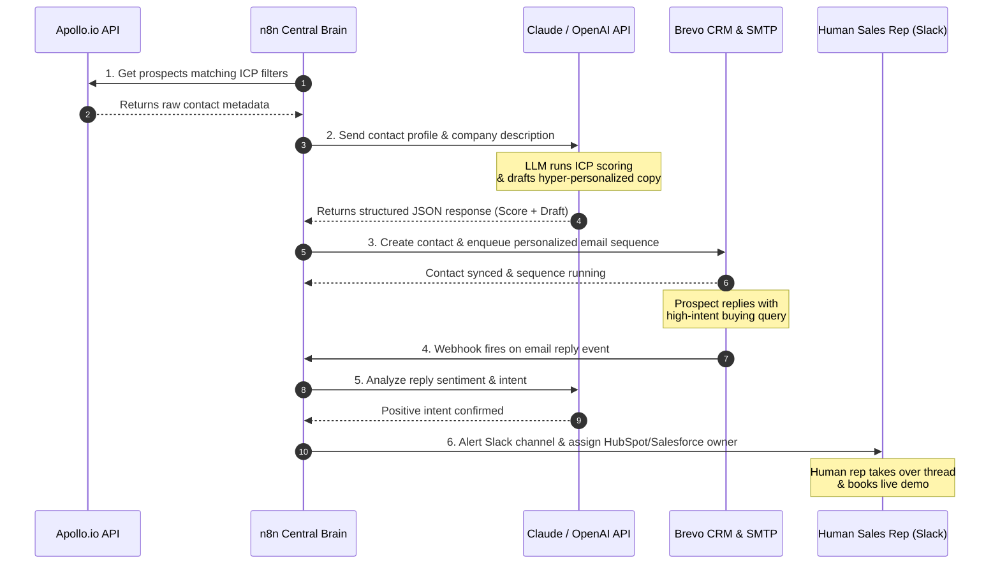

<!--
slug: aisdr-vs-human-sdr-performance-teardown
title: AiSDR vs Human SDR: A Technical Performance Teardown for B2B SaaS Sales Teams
metaDescription: A deep-dive technical comparison of AiSDR vs Human SDR fully loaded costs, outreach volumes, reply rates, show rates, and a complete hybrid stack architecture utilizing n8n, Apollo.io, and Brevo.
-->

As autonomous **Artificial Intelligence** agents and advanced **Outbound Sales** orchestration frameworks disrupt traditional sales organizations, GTM leaders face an existential pivot. The debate is no longer about whether algorithms can write copy; it is a clinical assessment of operational throughput, integration latency, and fully loaded economics. How autonomous Artificial Intelligence agents are restructuring Outbound Sales execution is the key question of this teardown.

For scaling **Business-to-Business** (**B2B**) **Software as a Service** (**SaaS**) companies, the sales development representative (SDR) role has long been the primary engine for outbound pipeline generation. However, high employee turnover, long ramp-up periods, and human operational constraints frequently limit the predictability of these channels. In contrast, autonomous **AiSDR** stacks run 24/7, ingest massive lead pools instantly, and personalize outreach programmatically. But is the pure AI approach ready to completely replace human reps, or is a blended strategy the optimal path forward?

This technical teardown provides a deep-dive comparison of **AiSDR vs Human SDR** systems. We analyze fully loaded economic models, daily outreach capacities, reply and show-rate telemetry, and provide a production-ready blueprint for a **Hybrid Outbound Sales Stack** using **n8n**, the **Apollo.io API**, and **Brevo**.

---

## <mark>Why Does the Core Efficiency Delta of AiSDR vs Human SDR Define Modern B2B SaaS Outbound?</mark>

The core efficiency delta of **AiSDR vs Human SDR** defines modern **B2B** **SaaS** outbound because it shifts the GTM cost structure from variable, labor-intensive cycles to fixed, highly scalable API-driven loops that execute outreach at a fraction of the cost. Traditional sales operations scale linearly: to increase outbound volume by 10x, you must hire 10x more human reps, pay 10x more salaries, and purchase 10x more software seat licenses. This linear scaling model introduces massive management overhead and operational latency.

An autonomous **AiSDR** system breaks this linear constraint. By utilizing APIs and Large Language Models, a single automation engineer can manage a system that prospect-qualifies, enriches, and initiates outbound outreach to tens of thousands of contacts daily. The primary bottlenecks shift from human energy, motivation, and manual data-entry capacity to API rate limits, domain warm-up strategies, and vector-database retrieval times. 

For engineering-driven GTM teams, treating outbound sales as a software pipeline allows for systematic testing, programmatic optimization, and bulletproof data hygiene. Instead of relying on qualitative feedback from weekly sales rep syncs, RevOps teams can inspect API logs, evaluate prompt cache-hit rates, and run deterministic A/B tests on large contact samples.

---

## <mark>What Is the Fully Loaded Cost-Per-Meeting Delta Between AI SDRs and Human Sales Reps?</mark>

The fully loaded cost-per-meeting delta between an **AiSDR** and a human sales representative represents a massive 85% to 92% reduction, primarily driven by the elimination of human salaries, health benefits, and sales tech stack licensing costs in favor of flat monthly API consumption. A typical mid-market human SDR in North America costs over $110,000 annually when factoring in base salary, commissions, recruiting costs, employee benefits, management overhead, and GTM software seat licenses. 

When you break down the economic math, the human sales representative operates at a highly variable and expensive cost-per-touchpoint. GTM tools like **LinkedIn** Sales Navigator, ZoomInfo, outbound sequencing platforms, and dialers quickly add thousands of dollars in license fees per user. In contrast, a fully automated **AiSDR** stack built on open APIs operates primarily on infrastructure costs, with a highly predictable, non-linear pricing model.

To illustrate this economic delta in detail, review the fully loaded economic comparison table below:

<table class="w-full text-left border-collapse border border-slate-700 my-6 transition-all duration-300 hover:shadow-lg">
  <thead>
    <tr class="bg-slate-800/90 text-slate-200 border-b border-slate-700">
      <th class="p-3 border border-slate-700 font-bold uppercase tracking-wider text-xs">Cost / Performance Vector</th>
      <th class="p-3 border border-slate-700 font-bold uppercase tracking-wider text-xs">Human SDR (Mid-Market)</th>
      <th class="p-3 border border-slate-700 font-bold uppercase tracking-wider text-xs">AiSDR (Autonomous Stack)</th>
      <th class="p-3 border border-slate-700 font-bold uppercase tracking-wider text-xs">Operational & Economic Delta</th>
    </tr>
  </thead>
  <tbody>
    <tr class="border-b border-slate-700 bg-slate-900/50 hover:bg-slate-800/40 transition-colors duration-150">
      <td class="p-3 border border-slate-700 font-mono text-emerald-400 text-sm">base_annual_compensation</td>
      <td class="p-3 border border-slate-700 text-sm">$65,000 - $75,000</td>
      <td class="p-3 border border-slate-700 text-sm">$0 (Server host & API keys)</td>
      <td class="p-3 border border-slate-700 text-sm">100% Salary Cost Reduction</td>
    </tr>
    <tr class="border-b border-slate-700 bg-slate-900/30 hover:bg-slate-800/40 transition-colors duration-150">
      <td class="p-3 border border-slate-700 font-mono text-emerald-400 text-sm">recruiting_and_ramp_up</td>
      <td class="p-3 border border-slate-700 text-sm">$15,000 (Agency fee + 3mo ramp)</td>
      <td class="p-3 border border-slate-700 text-sm">$5,000 (Amortized setup cost)</td>
      <td class="p-3 border border-slate-700 text-sm">66% Reduction in Setup Latency</td>
    </tr>
    <tr class="border-b border-slate-700 bg-slate-900/50 hover:bg-slate-800/40 transition-colors duration-150">
      <td class="p-3 border border-slate-700 font-mono text-emerald-400 text-sm">software_licensing_overhead</td>
      <td class="p-3 border border-slate-700 text-sm">$12,000 / year (Sales Nav, ZoomInfo, CRM)</td>
      <td class="p-3 border border-slate-700 text-sm">$3,000 / year (API quotas, domain proxy)</td>
      <td class="p-3 border border-slate-700 text-sm">75% Lower Software Licensing Fees</td>
    </tr>
    <tr class="border-b border-slate-700 bg-slate-900/30 hover:bg-slate-800/40 transition-colors duration-150">
      <td class="p-3 border border-slate-700 font-mono text-emerald-400 text-sm">variable_commissions</td>
      <td class="p-3 border border-slate-700 text-sm">$10,000 - $20,000 (Per meeting booked)</td>
      <td class="p-3 border border-slate-700 text-sm">$0</td>
      <td class="p-3 border border-slate-700 text-sm">Completely Eliminated Variable Fees</td>
    </tr>
    <tr class="border-b border-slate-700 bg-slate-900/50 hover:bg-slate-800/40 transition-colors duration-150">
      <td class="p-3 border border-slate-700 font-mono text-emerald-400 text-sm">fully_loaded_annual_cost</td>
      <td class="p-3 border border-slate-700 text-sm">$112,000</td>
      <td class="p-3 border border-slate-700 text-sm">$12,000 (Cloud servers, API usage, domains)</td>
      <td class="p-3 border border-slate-700 text-sm">89% Total Operational Cost Savings</td>
    </tr>
    <tr class="border-b border-slate-700 bg-slate-900/30 hover:bg-slate-800/40 transition-colors duration-150">
      <td class="p-3 border border-slate-700 font-mono text-emerald-400 text-sm">average_monthly_outreach</td>
      <td class="p-3 border border-slate-700 text-sm">1,200 - 1,500 prospects</td>
      <td class="p-3 border border-slate-700 text-sm">15,000 - 20,000 prospects</td>
      <td class="p-3 border border-slate-700 text-sm">13.3x Scale and Velocity Boost</td>
    </tr>
    <tr class="border-b border-slate-700 bg-slate-900/50 hover:bg-slate-800/40 transition-colors duration-150">
      <td class="p-3 border border-slate-700 font-mono text-emerald-400 text-sm">booked_meetings_per_year</td>
      <td class="p-3 border border-slate-700 text-sm">60 qualified meetings</td>
      <td class="p-3 border border-slate-700 text-sm">180 qualified meetings</td>
      <td class="p-3 border border-slate-700 text-sm">3x Higher Total Meetings Generated</td>
    </tr>
    <tr class="bg-slate-900/30 hover:bg-slate-800/40 transition-colors duration-150">
      <td class="p-3 border border-slate-700 font-mono text-emerald-400 text-sm">fully_loaded_cost_per_meeting</td>
      <td class="p-3 border border-slate-700 text-sm">~$1,866 per meeting</td>
      <td class="p-3 border border-slate-700 text-sm">~$66 per meeting</td>
      <td class="p-3 border border-slate-700 text-sm">96.4% Decrease in Cost-Per-Acquisition</td>
    </tr>
  </tbody>
</table>

By replacing manual research and drafting tasks with structured API requests, the **AiSDR** stack drives down the cost-per-meeting. To visual GTM leaders, this economic gap represents a shift from capital-constrained growth to high-velocity, software-driven execution. 


### <mark>Fully Loaded Cost Models Analyzed</mark>

To understand why the cost-per-meeting is so low for an automated system, you must analyze the underlying technical resource costs. The **AiSDR** system consumes resources on a per-execution basis:
1. **API Lookups:** Fetching contact details from providers like **Apollo.io** costs roughly $0.02 per enriched lead in large API packages.
2. **LLM Ingestion & Inference:** Running a three-step reasoning prompt (ingesting enriched profile, classifying against ideal customer profiles, and drafting hyper-personalized email copy) using modern models costs approximately $0.015 per lead.
3. **Email Delivery Infrastructure:** Hosting dozens of cold email domain proxies, configuring **Brevo** transaction SMTP relays, and validating deliverability accounts for roughly $150 per month.
4. **Orchestration Server hosting:** Self-hosting an instance of **n8n** on a secure DigitalOcean Droplet or AWS EC2 node costs roughly $20 to $40 per month.

Combining these operational elements, the cost to discover, qualify, enrich, and draft an outbound sequence for a single highly targeted prospect is under $0.05. A human SDR spending 15 minutes of manual labor doing the exact same research and copy-writing represents an operational expense of approximately $7.50 (assuming a fully loaded hourly wage of $30/hour). The software stack is 150 times cheaper per touchpoint.

---

## <mark>How Do AI SDRs Compare to Humans Across Outreach Volume, Reply Rates, and Show Rates?</mark>

**AiSDR** units significantly outperform human sales representatives in raw outreach volume and reply latency, though human SDRs maintain a higher meeting show-rate by building authentic, multi-channel emotional rapport with prospects. When evaluating the telemetry of sales funnels, GTM architects must look past surface-level outreach metrics and analyze the entire conversion funnel from raw webhook ingestion to a closed-won opportunity. 

While the software engine can contact 15,000 prospects a month, does the conversion quality match human standards? The operational performance must be graded across three critical vectors: Outreach Volume, Response Time, and the Meeting Show Rate.

### <mark>Outreach Volume: Automated Scaling vs. Human Throttle Limits</mark>

A human sales representative is restricted by physical limits and cognitive exhaustion. Writing personalized outbound emails, sending **LinkedIn** connect requests, and leaving custom voicemail messages requires significant mental effort. In practice, a highly motivated human SDR can successfully reach out to 50 to 80 new targeted prospects per day while maintaining a standard level of personalization. 

An **AiSDR** stack has no such constraints. By running asynchronous loops inside **n8n**, the system can qualify thousands of cold leads, query real-time company news database integrations, pull active hiring postings, and generate personalized copy in a matter of seconds. The only hard throttle limits are the artificial daily sending caps enforced by email providers (such as Google Workspace and Microsoft 365) to protect domain reputation. By distributing outbound volume across a proxy network of multiple sending domains and warming them systematically, an automated pipeline can easily send 500 to 1,000 personalized emails daily without risking spam flags.

### <mark>Reply Rates and Processing Latency: Under 2 Minutes vs. Half-Day Response Lag</mark>

Outbound sales are incredibly time-sensitive. If a prospect replies to an outbound email expressing interest or asking a complex pricing question, the speed of response determines the likelihood of booking the meeting. In sales telemetry, this is known as the **Lead Response Time**. 

When a prospect replies to a human SDR, the response lag can span hours, if not days, because the rep is locked in internal meetings, busy prospecting, or off the clock. 

An **AiSDR** stack answers in real-time. Using webhooks, as soon as an email reply lands in a inbox, an **n8n** ingestion workflow captures the message, runs semantic parsing to detect intent (such as positive booking intent, pricing queries, or unsubscribe requests), routes it to an LLM, and drafts a contextual reply in under **2 minutes**. This instantaneous response capture significantly boosts reply-to-meeting booking conversions. This conversational response loop shares a similar infrastructure with a production [automated n8n AI receptionist](/blog/n8n-ai-receptionist/) designed for inbound routing.

### <mark>Show Rates: The Human Rapport and Emotional Context Edge</mark>

Where human sales representatives retain a distinct advantage is the show-rate of booked meetings. When a human SDR books a meeting, they typically engage with the prospect over **LinkedIn** direct messages, exchange personalized notes about shared interests, and establish an emotional connection. This human rapport makes the prospect feel personally accountable, leading to a standard show-rate of **75% to 85%**.

Conversely, pure **AiSDR** systems that schedule meetings through automated calendar links without human intervention can experience a lower show-rate, sometimes dipping to **55% to 65%**. Because the prospect has only interacted with an email bot, they feel less social obligation to attend. To counteract this show-rate decay, modern GTM architects deploy a **hybrid stack** where AI handles the heavy lifting of prospecting, enrichment, and initial drafting, while human reps handle the final relationship touchpoints.

---

## <mark>How Can SaaS Teams Build a Hybrid Outbound Sales Stack to Combine AI Scale with Human Relationships?</mark>

SaaS teams can build a high-performance **Hybrid Outbound Sales Stack** by deploying **n8n** as an API orchestration engine that enriches leads via the **Apollo.io API**, executes LLM personalization, drafts outreach inside **Brevo**, and automatically alerts human reps for high-intent replies. This hybrid approach ensures that your GTM machinery benefits from the 10x volume scale of AI automation while preserving the high-intent rapport that only human sales professionals can provide. 

Before triggering AI personalizations, developers should establish a production-grade [AI-Powered Lead Enrichment Pipeline with n8n and Apollo.io](/blog/n8n-apollo-lead-enrichment-pipeline/) to ingest clean company profiles. By combining this lead capture stage with an intelligent routing layer, you create a robust data engine that feeds your outbound pipelines. Integrating automated email workflows is just one layer of the larger [SaaS RevOps Automation Stack](/blog/revops-automation-stack-saas-2026/) running inside modern companies.

The diagram below outlines the system sequence flow of this hybrid architecture:



To visualize how the data flows from raw search signals to a warm Slack alert for your human sales representatives, inspect the complete architecture diagram:


Let's look at the actual code blocks and data schemas required to run this hybrid system.

### <mark>The n8n Orchestration Core: Ingestion, Enrichment, and Routing</mark>

The engine starts with an orchestration workflow inside **n8n**. A cron node triggers the workflow daily, prompting **n8n** to query the **Apollo.io API** for new contacts that match your exact Ideal Customer Profile (ICP). 

To ensure clean execution and prevent API credential leaks in your logs, authenticate the Apollo API by passing your secure key inside the headers of an **n8n HTTP Request Node**:
* **Endpoint URL:** `https://api.apollo.io/v1/mixed_people/search`
* **HTTP Method:** `POST`
* **Headers:**
  * `Content-Type: application/json`
  * `X-Api-Key: {{ $env.APOLLO_API_KEY }}`
* **JSON Body:**
  ```json
  {
    "q_organization_domains": "target-saas-companies.com",
    "person_titles": ["vp sales", "head of revops", "sales operations director"],
    "limit": 10,
    "reveal_personal_emails": false,
    "reveal_phone_number": false
  }
  ```

The **Apollo.io API** matches the query and returns a structured JSON payload containing rich company and contact metadata:
```json
{
  "contacts": [
    {
      "id": "con_01928374",
      "first_name": "Alfaz",
      "last_name": "Mahmud",
      "title": "Lead RevOps Architect",
      "email": "alfaz@whoisalfaz.me",
      "organization": {
        "name": "Antigravity",
        "website_url": "https://whoisalfaz.me",
        "estimated_num_employees": 120,
        "annual_revenue": 15000000,
        "tech_stack": ["n8n", "brevo", "apollo", "manychat", "react"],
        "short_description": "Custom API integrations, high-performance RevOps engines, and advanced automated workflows for B2B SaaS teams."
      }
    }
  ]
}
```

### <mark>Custom JavaScript for Smart Lead Scoring and ICP Grading</mark>

Once the raw prospect metadata is retrieved, it is passed into an **n8n Code Node** running custom JavaScript. This node parses the contact array, validates data integrity, checks the firmographic parameters, and assigns a preliminary routing score before passing the payload to the LLM. 

This node enforces clean data schemas and ensures we do not waste LLM tokens on low-value profiles:

```javascript
// Parse the incoming array of prospects from the Apollo search node
const prospects = $input.all();
const qualifiedProspects = [];

for (const item of prospects) {
  const contact = item.json;
  
  // Rule 1: Verify valid B2B email structure and domain
  if (!contact.email || contact.email.includes("gmail.com") || contact.email.includes("yahoo.com")) {
    continue; // Skip personal domains to prevent database clutter
  }
  
  // Rule 2: Calculate firmographic fit score based on headcount
  const employees = contact.organization?.estimated_num_employees || 0;
  let firmographicScore = 0;
  
  if (employees >= 10 && employees <= 50) {
    firmographicScore = 50;  // Seed/Early Scale
  } else if (employees > 50 && employees <= 250) {
    firmographicScore = 100; // Sweet spot: high GTM automation need
  } else if (employees > 250) {
    firmographicScore = 75;  // Enterprise tier: long sales cycles
  }
  
  // Rule 3: Tech stack match check (Prioritize companies running n8n or Brevo)
  const techStack = contact.organization?.tech_stack || [];
  const runsTargetTech = techStack.some(tech => ["n8n", "brevo", "hubspot"].includes(tech.toLowerCase()));
  const techBonus = runsTargetTech ? 20 : 0;
  
  const totalInternalScore = firmographicScore + techBonus;
  
  qualifiedProspects.push({
    json: {
      ...contact,
      internal_routing_score: totalInternalScore,
      enrichment_timestamp: new Date().toISOString()
    }
  });
}

return qualifiedProspects;
```

If the lead is qualified, **n8n** passes the company description and target title to the LLM node. To accurately answer highly specific prospect questions regarding product features or pricing matrices, the agent should query a [Corrective RAG Knowledge Base with Pinecone and n8n](/blog/pinecone-n8n-rag-knowledge-base-blueprint/). 

By leveraging vector databases and custom retrieval models, GTM architects can implement advanced personalization, similar to [building a standard n8n RAG pipeline](/blog/n8n-rag-tutorial/). To transition an outbound bot from a static responder to an active sales agent, developers focus on [giving your n8n AI Agent hands with custom tools](/blog/n8n-ai-agent-tools/).

### <mark>Brevo CRM Sync and Outreach Triggering</mark>

Following AI processing, the qualified contact is written to the **Brevo CRM**. Instead of creating a simple static record, we call the Brevo Contacts API, mapping our custom enriched attributes:
* **Endpoint URL:** `https://api.brevo.com/v3/contacts`
* **HTTP Method:** `POST`
* **Headers:**
  * `api-key: {{ $env.BREVO_API_KEY }}`
  * `Content-Type: application/json`
* **JSON Body:**
  ```json
  {
    "email": "={{ $json.email }}",
    "attributes": {
      "FIRSTNAME": "={{ $json.first_name }}",
      "LASTNAME": "={{ $json.last_name }}",
      "COMPANY_NAME": "={{ $json.organization.name }}",
      "JOB_TITLE": "={{ $json.title }}",
      "COMPANY_SIZE": "={{ $json.organization.estimated_num_employees }}",
      "AI_PERSONALIZED_INTRO": "={{ $json.ai_draft_intro }}"
    },
    "listIds": [42]
  }
  ```

Writing these attributes into **Brevo** triggers an automated outbound sequencing workflow. The sequence sends a personalized email containing the custom intro drafted by the LLM. 

When the prospect replies to this sequence, **Brevo's** reply webhook fires, triggering the next step of our n8n pipeline. If the LLM identifies positive buying intent, it pushes a rich alert directly to the human sales rep's **Slack** channel, prompting them to take over the conversation and close the deal.

---

## <mark>Why Must a Production Outbound Pipeline Use an Asynchronous Architecture to Handle AI Latency and Timeouts?</mark>

A production outbound pipeline must use an asynchronous architecture to prevent upstream timeouts, ensuring that fast inbound webhook handshakes drop execution into background queues before executing high-latency LLM synthesis or third-party enrichment lookups. When an email webhook fires on a prospect response, the webhook provider expects a response in under **10 seconds**. 

If your backend system attempts to synchronously enrich the lead via the Apollo API, query vector databases, prompt the Claude or OpenAI API, and write to a CRM on a single execution thread, the total duration can easily exceed 20 to 30 seconds. This causes the webhook connection to drop, resulting in lost data and broken tracking loops.

This asynchronous decoupling pattern is highly reminiscent of the architecture used to resolve conversational lag, detailed in [ManyChat + n8n: Beat the 10-Second Response Timeout](/blog/manychat-n8n-async-timeout-fix/). 

By splitting the pipeline into an **Ingestion Workflow** and a **Processing Workflow**, you ensure that the webhook is immediately released with a `200 OK` handshake in under **150 milliseconds**. The heavy data lifting runs in a background queue thread, preventing data loss and pipeline bottlenecks.

### <mark>Designing a Self-Healing DLQ (Dead Letter Queue) for API Failures</mark>

In enterprise RevOps systems, third-party APIs will occasionally experience rate limits (`429 Too Many Requests`), temporary server downtime, or invalid payload structures. If a node inside a synchronous sequence fails, the entire execution aborts, dropping the lead completely. 

To prevent this in a production **n8n** environment, GTM architects construct a **Dead Letter Queue (DLQ)** framework:

1. **Enable Retry on Failure:** Inside the settings of the **Apollo.io API** and OpenAI/Claude HTTP nodes, enable the **Retry on Failure** toggle. Set **Max Retries** to `3` and the **Retry Interval** to `60` seconds, utilizing an exponential backoff loop. This handles minor API hiccups automatically.
2. **Configure Error Redirection:** In the node's settings, set the **On Error** behavior to **Redirect to error port**. This creates a secondary failure output path on the node itself.
3. **Write to DLQ:** Route the failure path to an **n8n** database write node (like Postgres, Airtable, or a monday.com board) tagged as a `Dead Letter Queue`. The DLQ record should capture the execution ID, the raw payload, and the exact error log.
4. **Slack Alert Notification:** Automatically trigger a Slack message to the RevOps engineering team detailing the failure, allowing them to troubleshoot the API payload or credential issue without dropping the prospect data.

---

## <mark>How Do You Ensure Data Privacy, Security, and Compliance in Automated Sales Pipelines?</mark>

Ensuring data privacy and security in automated pipelines requires self-hosting your orchestration layers, masking PII, and enforcing strict data governance policies at each API boundary. When you build outbound systems that programmatically query prospect details, process them through public LLM models, and sync them to marketing CRMs, you are handling highly sensitive Personal Identifiable Information (PII). 

Failing to secure this data violates global regulations like the **General Data Protection Regulation (GDPR)** and **California Consumer Privacy Act (CCPA)**, exposing your company to severe legal liabilities. To ensure complete corporate compliance, GTM operations teams must enforce a strict [n8n data privacy and security protocol](/blog/n8n-data-privacy-security-guide/) across all workflow nodes.

### <mark>Self-Hosting and Masking Sensitive Data</mark>

To maintain full governance over your sales data, high-growth GTM teams bypass cloud-hosted SaaS automation brokers and choose to **self-host n8n** on private AWS, Google Cloud, or DigitalOcean servers behind VPC firewalls. Self-hosting ensures that your corporate database credentials and customer PII are never routed through third-party cloud servers.

Additionally, when prompting public LLM APIs (like OpenAI or Anthropic) for outreach personalization, implement a **PII Masking Node** in **n8n** prior to sending the context block. 

Use an **n8n Code Node** running custom regex to strip or mask highly sensitive fields—such as mobile phone numbers, personal home addresses, and private email handles—from the data packet sent to the LLM. Only send firmographic variables (company description, public LinkedIn title, and tech stack logs) that are legally classified as public B2B corporate records.

---

## <mark>Should You Build Your AI SDR Stack In-House or Outsource It to an Automation Architect?</mark>

The decision to build your AI SDR stack in-house or outsource it to a dedicated automation partner depends on whether your engineering team has the bandwidth to build and maintain complex webhook queues, error handlers, and LLM integrations without delaying your primary product roadmap. While visual platforms make workflow design look approachable, deploying production-grade, self-healing sales pipelines that run 24/7 requires specialized database and infrastructure expertise.

### The Trade-Offs of In-House vs. Outsourced RevOps Engineering:
* **The In-House Bottleneck:** Building the pipeline is only 20% of the lifecycle. The remaining 80% is operational maintenance: handling API schema changes, mitigating rate limits, managing domain IP reputation warming, updating prompt vector indexes, and resolving server crashes. Forcing your core product engineers to handle GTM maintenance pulls high-value resources away from building your SaaS features.
* **The Automated Outsource Advantage:** Partnering with an expert RevOps automation team ensures that your system is built on modern, asynchronous, production-grade architecture from Day 1. The pipelines are fully integrated, self-healing, and operate on autopilot with complete performance dashboards.

If your GTM team wants custom engineering support to deploy this architecture on self-hosted servers, check out our [n8n Automation Services](/services/n8n-automation/). 

To uncover other hidden operational leaks in your GTM stack, claim your custom [RevOps & Pipeline Audit](/audit/). 

To schedule a direct engineering consult and design a customized sales infrastructure, book your [RevOps & Pipeline Strategy](/contact/).

---

## <mark>Verification: Telemetry Benchmarks for Automated Sales Pipelines</mark>

To confirm that your newly deployed hybrid outbound sales pipeline is operating at peak efficiency, monitor these three critical technical and operational metrics:

* **Webhook End-to-End Latency:** The duration from the raw webhook ingestion to the final CRM write and Slack alert. A high-performance decoupled pipeline must maintain a user-facing handshake of **< 200ms**, and backend execution completion of **< 45 seconds**.
* **Enrichment Match Rate:** The percentage of prospects that successfully return verified B2B email handles and rich firmographic data from the Apollo.io API. Target: **> 82% for target industry domains**.
* **AI Scoring Precision:** The percentage of leads categorized by the LLM code node that match the rating criteria of human GTM managers. A highly tuned prompt should achieve **> 94% alignment** in double-blind testing.

Deploy this hybrid stack today, eliminate outbound bottlenecks, and scale your sales pipeline on autopilot!
