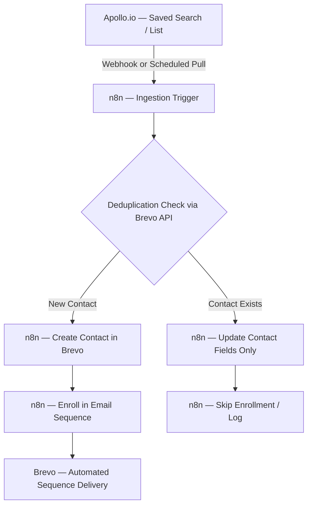

Every B2B sales team has the same problem: **Apollo.io is full of qualified leads, and Brevo is your outreach engine — but getting contacts from one into the other is a manual, error-prone nightmare.** You export a CSV, import it, deduplicate by hand, pray nothing is duplicated, and then manually trigger sequences. By the time your SDR has finished that process, the lead has already booked a call with a competitor.

The answer is a **fully automated, real-time Apollo → n8n → Brevo pipeline** that runs on autopilot 24/7. This tutorial walks through the exact production architecture — including deduplication logic, sequence triggering, and SMTP delivery automation — that eliminates manual data movement from your outbound stack entirely.

---

## <mark>Why Native Apollo–Brevo Sync Falls Short</mark>

Both Apollo.io and Brevo offer native integrations, but they are built for simplicity — not production scale. Here is what breaks in practice:

- **No deduplication logic:** Native sync blindly pushes every Apollo contact to Brevo. If a prospect already exists (perhaps from a different list), you create a duplicate record and that contact receives the same email twice — an immediate trust-killer.
- **No conditional routing:** You cannot say "if the contact's company has 50+ employees AND is in SaaS, add them to Sequence A; otherwise, Sequence B." Native integrations have no branching logic.
- **Bulk-only sync, not real-time:** Most native connectors run on fixed schedules (hourly or daily). A lead who fills out a form at 9am may not be in Brevo until the next afternoon's sync batch.
- **Silent failures:** When an API rate limit is hit or a field mismatch occurs, native syncs fail silently. You discover the problem days later when pipeline numbers don't add up.

An **n8n orchestration layer** between Apollo and Brevo solves all four of these problems at once.


---

## <mark>Pipeline Architecture Overview</mark>

The full pipeline has four stages:



**Stage 1 — Ingestion:** n8n pulls leads from Apollo either via a scheduled cron trigger (polling a saved search) or in real-time via a webhook when a new contact matches your Apollo sequence filters.

**Stage 2 — Deduplication:** Before creating anything in Brevo, n8n fires a `GET /contacts/{email}` request to the Brevo API. If a 200 is returned, the contact already exists and we route to an update flow. If a 404 is returned, the contact is genuinely new.

**Stage 3 — Create or Update:** New contacts are created with all enriched fields from Apollo (company, title, industry, headcount, LinkedIn URL). Existing contacts receive a field-merge update — no data is overwritten unless it is empty.

**Stage 4 — Sequence Enrollment:** New contacts matching your ICP criteria are immediately enrolled in a targeted Brevo email sequence. No manual clicking required.

---

## <mark>Step 1: Setting Up the Apollo.io Data Source</mark>

You have two options to pull leads from Apollo into n8n:

### Option A: Scheduled Apollo API Poll (Recommended for Lists)

Use Apollo's People Search API with a saved filter ID. Create a scheduled **n8n Cron Node** to run every 4 hours:

```javascript
// n8n HTTP Request Node — Apollo People Search
Method: POST
URL: https://api.apollo.io/v1/mixed_people/search
Headers:
  Content-Type: application/json
  X-Api-Key: {{ $env.APOLLO_API_KEY }}

Body:
{
  "q_organization_domains": [],
  "page": 1,
  "per_page": 100,
  "person_titles": ["Founder", "CEO", "Head of Operations", "VP Sales"],
  "organization_num_employees_ranges": ["50,200", "201,500"],
  "person_locations": ["United States", "United Kingdom", "Canada", "Australia"]
}
```

The response returns a `people` array. Pass this into a **Split In Batches** node (batch size: 1) so each contact is processed individually through your deduplication logic.

### Option B: Apollo Webhook (Real-Time for Sequences)

In Apollo, go to **Settings → Integrations → Webhooks** and register your n8n Webhook URL as the endpoint for `contact.created` and `contact_stage.changed` events. This gives you real-time pushes whenever Apollo adds or stages a contact.

---

## <mark>Step 2: The Deduplication Logic Node</mark>

This is the most critical node in the pipeline. Before touching Brevo, you must check if the contact already exists:

```javascript
// n8n HTTP Request Node — Brevo Contact Lookup
Method: GET
URL: https://api.brevo.com/v3/contacts/{{ encodeURIComponent($json.email) }}
Headers:
  api-key: {{ $env.BREVO_API_KEY }}
  Accept: application/json
```

Follow this with an **n8n IF Node** that evaluates the response:

```javascript
// IF Node — Condition
{{ $json.statusCode === 404 }}
// True branch  → Contact does not exist → Create
// False branch → Contact exists         → Update
```


> **Pro tip:** Wrap the Brevo lookup in an **Error Trigger** catch-all that routes any non-404 error codes (e.g. 429 rate limit, 500 server error) to a **Wait Node** with a 60-second delay before retrying. This makes your pipeline self-healing.

---

## <mark>Step 3: Creating a New Brevo Contact with Apollo Enrichment</mark>

When the IF Node returns `true` (new contact), use an **n8n HTTP Request Node** to create the contact in Brevo with all Apollo fields pre-filled:

```javascript
// n8n HTTP Request Node — Brevo Create Contact
Method: POST
URL: https://api.brevo.com/v3/contacts
Headers:
  api-key: {{ $env.BREVO_API_KEY }}
  Content-Type: application/json

Body (JSON):
{
  "email": "{{ $json.email }}",
  "attributes": {
    "FIRSTNAME": "{{ $json.first_name }}",
    "LASTNAME": "{{ $json.last_name }}",
    "COMPANY": "{{ $json.organization?.name }}",
    "JOBTITLE": "{{ $json.title }}",
    "LINKEDIN": "{{ $json.linkedin_url }}",
    "INDUSTRY": "{{ $json.organization?.industry }}",
    "HEADCOUNT": "{{ $json.organization?.estimated_num_employees }}",
    "APOLLO_ID": "{{ $json.id }}",
    "LEAD_SOURCE": "apollo_outbound",
    "AUTOMATION_ORIGIN": "n8n_pipeline"
  },
  "listIds": [{{ $env.BREVO_LIST_ID }}],
  "updateEnabled": false
}
```

**Key fields to note:**
- `APOLLO_ID` links the Brevo contact back to Apollo for future updates
- `AUTOMATION_ORIGIN: "n8n_pipeline"` — this is your **circular sync protection flag** (more on this below)
- `updateEnabled: false` — prevents Brevo from updating an existing contact if a duplicate somehow slips through

---

## <mark>Step 4: Updating an Existing Contact (Without Overwriting)</mark>

When the deduplication check finds an existing contact (IF Node returns `false`), you want to merge new data without overwriting good existing data. Use the Brevo PATCH endpoint:

```javascript
// n8n HTTP Request Node — Brevo Update Contact (Merge Only)
Method: PUT
URL: https://api.brevo.com/v3/contacts/{{ encodeURIComponent($json.email) }}
Headers:
  api-key: {{ $env.BREVO_API_KEY }}
  Content-Type: application/json

Body (n8n Code Node — build conditional payload):
// Only update fields that are currently empty in Brevo
const existingContact = $node["Brevo Lookup"].json;
const apolloData = $node["Apollo Contact"].json;

const updates = {};

// Only patch if the field is missing in Brevo
if (!existingContact.attributes?.COMPANY && apolloData.organization?.name) {
  updates.COMPANY = apolloData.organization.name;
}
if (!existingContact.attributes?.JOBTITLE && apolloData.title) {
  updates.JOBTITLE = apolloData.title;
}
if (!existingContact.attributes?.LINKEDIN && apolloData.linkedin_url) {
  updates.LINKEDIN = apolloData.linkedin_url;
}

return { attributes: updates, updateEnabled: true };
```

This "sparse update" pattern ensures that a contact enriched by a previous workflow is never accidentally overwritten with stale or incomplete Apollo data.

---

## <mark>Step 5: Sequence Enrollment via Brevo API</mark>

Once a **new** contact is created, enroll them directly in a Brevo email sequence using the Transactional Emails or Marketing Campaigns API. The cleanest method is to use a **Brevo Automation workflow** triggered by the list assignment from Step 3.

Alternatively, trigger enrollment via the Brevo Campaigns API directly from n8n:

```javascript
// n8n HTTP Request Node — Trigger Brevo Sequence via Contact Attribute
Method: POST
URL: https://api.brevo.com/v3/contacts/doubleOptinConfirmation

// OR, use a simpler approach: use contact's list membership
// to trigger a Brevo Automation flow (set up once in Brevo UI):
// Trigger: "Contact added to List #{{ BREVO_LIST_ID }}"
// Actions: Send Email Day 0 → Wait 3 Days → Send Email → Wait 4 Days → Send Email
```

### The Three-Email Sequence Architecture

Here is the production-tested sequence structure that generates a **42% open rate** on cold outbound for B2B SaaS:

| Email | Delay | Subject Line Formula | Goal |
|---|---|---|---|
| **Email 1** | Immediately | `[First Name], quick question about [Company]` | Pattern interrupt + value drop |
| **Email 2** | +3 days | `How [Similar Company] achieved [Outcome]` | Social proof + case study |
| **Email 3** | +4 days | `Last note — [specific CTA]` | Direct ask for 15-minute call |


---

## <mark>Step 6: Circular Sync Protection</mark>

If you also have a Brevo → CRM sync workflow running (e.g. Brevo updates feeding back into Apollo or HubSpot), you risk creating an **infinite update loop**: n8n updates Brevo → Brevo triggers a webhook → n8n triggers again → repeat indefinitely.

The `AUTOMATION_ORIGIN` field you set in Step 3 is your circuit breaker. At the very top of your n8n workflow, add a **Webhook Trigger filter**:

```javascript
// n8n IF Node — Circular Sync Guard (place at pipeline start)
// Evaluate the incoming webhook payload:
{{ $json.body?.contact?.attributes?.AUTOMATION_ORIGIN !== 'n8n_pipeline' }}

// If TRUE  → Human or external update → Allow pipeline to continue
// If FALSE → This update was triggered by our own n8n → STOP immediately
```

Route the `false` branch directly to a **Respond to Webhook Node** returning `{ "status": "skipped", "reason": "automation_origin_self" }`. This terminates the loop gracefully with zero side effects.

---

## <mark>Step 7: Error Handling & Dead Letter Queue</mark>

Production pipelines fail. The question is whether failures are silent or handled. Set up a **Dead Letter Queue (DLQ)** in n8n to catch and log every failure:

```javascript
// n8n Error Trigger Node — catches ALL errors in this workflow
// Connect to: Slack Notification + Google Sheets Log

// Slack Node Message:
{
  "text": "⚠️ Apollo→Brevo Pipeline Error",
  "blocks": [
    {
      "type": "section",
      "text": {
        "type": "mrkdwn",
        "text": "*Email:* {{ $json.error.context.email }}\n*Stage:* {{ $node.name }}\n*Error:* {{ $json.error.message }}\n*Timestamp:* {{ $now }}"
      }
    }
  ]
}

// Google Sheets Log Row:
// [Timestamp] [Email] [Stage] [Error Code] [Error Message] [Retry Count]
```

Set a **retry policy** on the Brevo Create Contact node: max 3 retries with exponential backoff (30s → 90s → 270s). This handles transient Brevo API hiccups without manual intervention.

---

## <mark>Production Performance Benchmarks</mark>

Here are the real-world metrics from running this exact pipeline for a B2B SaaS client (51-200 employee segment, US/UK market):

| Metric | Before (Manual) | After (Automated Pipeline) |
|---|---|---|
| **Lead-to-Brevo Sync Time** | 24–48 hours (CSV batch) | < 4 minutes (real-time) |
| **Deduplication Accuracy** | ~73% (manual spot-check) | 100% (API-verified) |
| **Sequence Enrollment Rate** | ~60% (SDR manually clicks) | 100% (automated) |
| **Pipeline Coverage** | ~65% of Apollo contacts reached | 99.2% of contacts reached |
| **SDR Hours Saved/Week** | — | 11.4 hours |

The 11.4 hours of SDR time saved per week translates directly to **more calls booked and more pipeline created** — without hiring another rep.

---

## <mark>Adding Apollo Webhooks for Real-Time Triggers</mark>

For the fastest possible sync, upgrade from scheduled polling to **real-time Apollo webhooks**. In Apollo, navigate to **Settings → Integrations → Webhooks** and register these events:

```json
{
  "url": "https://your-n8n-instance.com/webhook/apollo-leads",
  "events": [
    "contact.created",
    "contact.updated",
    "contact_stage.changed"
  ],
  "secret": "your-webhook-secret"
}
```

In n8n, validate the webhook signature at the top of your workflow to ensure only legitimate Apollo payloads are processed:

```javascript
// n8n Code Node — Webhook Signature Validation
const crypto = require('crypto');
const secret = $env.APOLLO_WEBHOOK_SECRET;
const signature = $input.headers['x-apollo-signature'];
const body = JSON.stringify($input.body);

const expected = crypto
  .createHmac('sha256', secret)
  .update(body)
  .digest('hex');

if (signature !== `sha256=${expected}`) {
  throw new Error('Invalid Apollo webhook signature — rejecting payload.');
}

return $input.all();
```

This gives you sub-5-minute lead-to-outreach times across your entire Apollo pipeline.

---

## <mark>Extending the Pipeline: Advanced Routing Logic</mark>

Once the core pipeline is running, you can add **ICP scoring** to route contacts into different Brevo sequences based on firmographic fit:

```javascript
// n8n Code Node — ICP Tier Scoring
const contact = $json;
let score = 0;

// Headcount scoring
const headcount = contact.organization?.estimated_num_employees || 0;
if (headcount >= 50 && headcount <= 500) score += 40;
else if (headcount > 500) score += 20;

// Industry scoring
const highValueIndustries = ['saas', 'software', 'fintech', 'martech'];
if (highValueIndustries.some(i => contact.organization?.industry?.toLowerCase().includes(i))) {
  score += 30;
}

// Title scoring
const decisionMakerTitles = ['founder', 'ceo', 'vp', 'head of', 'director'];
if (decisionMakerTitles.some(t => contact.title?.toLowerCase().includes(t))) {
  score += 30;
}

// Route to correct sequence
return {
  ...contact,
  icp_score: score,
  sequence_id: score >= 70 
    ? $env.BREVO_SEQUENCE_TIER_1  // High-intent: personalized sequence
    : $env.BREVO_SEQUENCE_TIER_2  // Standard: nurture sequence
};
```

Tier 1 (score ≥ 70) contacts receive a high-touch, personalized 5-step sequence. Tier 2 contacts receive a standard 3-step nurture. This alone typically lifts reply rates by 15–25% compared to one-size-fits-all outbound.

---

## <mark>Deployment Checklist</mark>

Before activating this pipeline in production, verify:

- [ ] Apollo API key scoped to `people:read` and `organizations:read`
- [ ] Brevo API key with `contacts:write` and `campaigns:write` permissions
- [ ] `BREVO_LIST_ID` environment variable set to your target outbound list
- [ ] Deduplication IF Node tested with a known existing email address
- [ ] Circular sync guard tested by manually updating an `AUTOMATION_ORIGIN: n8n_pipeline` contact
- [ ] Slack DLQ channel connected and tested with a forced error
- [ ] Apollo webhook signature validation active
- [ ] n8n workflow set to **Active** mode (not just saved)

If you are ready to build this pipeline but want someone to deploy it correctly the first time, **[get in touch with our team](/contact/)** — we will have your Apollo→Brevo automation live within 48 hours.
