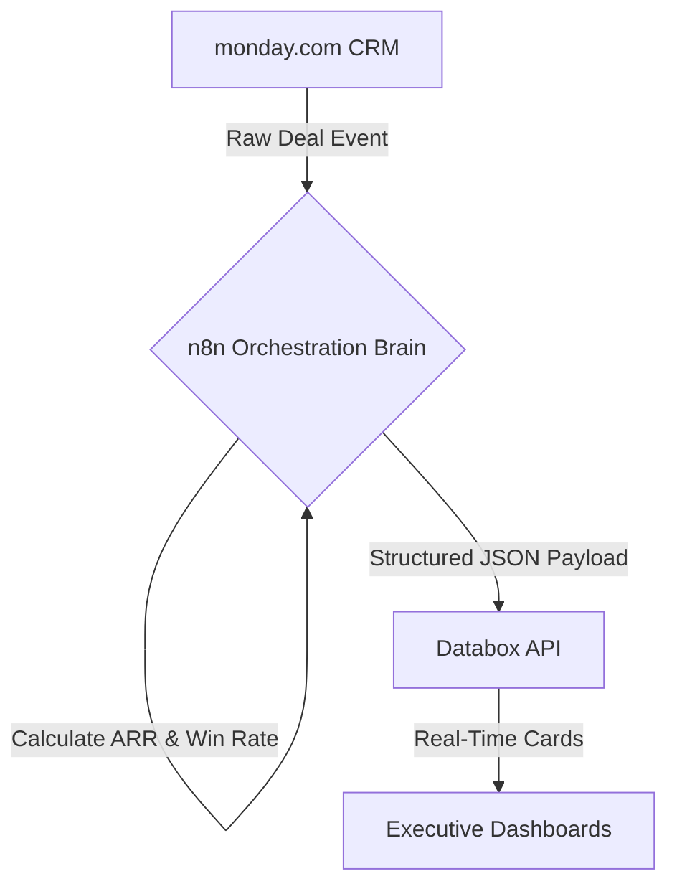
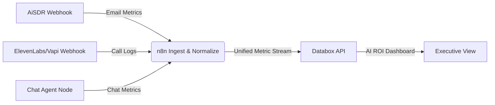

In the hyper-accelerated landscape of B2B SaaS, **predictive revenue growth is no longer driven by sheer sales headcount—it is a function of pipeline math and automation velocity**. Yet, the typical sales reporting workflow is a chaotic manual chore. Operations leads waste hours exporting CSV files from monday.com, sales managers argue over outdated static spreadsheets, and marketing teams remain blind to which campaign sources actually generate Annual Recurring Revenue (ARR).

This reporting latency—known as the **GTM visibility gap**—creates a dangerous delay in detecting sales funnel leaks. When your average sales cycle length or win rate slips, you only find out during the monthly or quarterly business review: weeks after the damage is done.

High-growth teams close this gap by building a **real-time RevOps dashboard engine**. By orchestrating data from your CRM ([**monday.com**](/blog/monday-com-automation-recipes-revops-2026/)) and custom AI SDR pipelines through a centralized workflow brain ([**n8n**](/services/n8n-automation/)), you can stream live metrics directly into a dedicated business intelligence hub (**Databox**). This guide delivers a production-grade, copy-pasteable architectural blueprint to automate Pipeline Velocity tracking, Win Rate calculation, and ARR attribution—including dedicated tracking setups for outbound AI agents.

> **Who this guide is for:** RevOps managers, sales engineers, and automation architects at B2B SaaS companies running 50+ active deals per month who need a single pane of glass across their entire GTM stack. If you want someone to build this for you, review our [RevOps consulting and automation services](/services/growth-consulting/).

---

## <mark>The Frankenstack Dilemma: Why Sales Pipelines Stagnate Without Real-Time Analytics</mark>

A **Frankenstack** is a collection of GTM applications loosely connected via out-of-the-box native sync integrations. While easy to set up initially, these native plugins fail under high deal volumes due to silent synchronization errors and rigid data structures. The result is a pipeline that *looks* healthy in your CRM while *bleeding* quietly in the background.

For [Revenue Operations (RevOps)](/blog/what-is-revops-technical-definition-saas/) teams, the root bottleneck is the lack of historical stage tracking. Native CRM plugins can easily sync a deal's *current* status, but they cannot tell you *how long* that deal sat in the "Proposal Sent" stage before closing—which is precisely the data that separates 25-day sales cycles from 90-day ones.



### The Three Operational Bottlenecks That Kill Pipeline Visibility:

* **The Formula Column Trap:** Native formula columns in monday.com are calculated in the browser at render time. Because their values are never written back to the database as stored fields, they cannot trigger API webhooks or fire downstream automations. Any metric you see in a formula column is invisible to your reporting stack. The fix is to use physical date columns stamped by automations—covered in detail below.

* **Aggregated AI Blindness:** While outbound tools like [AiSDR](/blog/cold-email-machine-apollo-aisdr-brevo/) or [ElevenLabs/Vapi](/blog/elevenlabs-n8n-voice-ai-sales-agent/) track their own reply and call rates, these metrics live in separate application silos. Leadership cannot see how AI outreach cost scales against actual CRM conversions—making ROI calculations impossible without manual assembly.

* **Sync Latency and API Throttling:** Running batch-export scripts to update reporting databases frequently hits API rate limits, resulting in data discrepancy and delayed dashboard cards. A deal that closed 45 minutes ago may not appear in your dashboard for hours. For real-time decision making, this is unacceptable.

By leveraging **n8n** as an event-driven, API-first broker, you decouple your CRM database from your analytics platform entirely—enabling conditional logic, custom calculations, retry handling, and resilient rate-limit management that native integrations simply cannot provide.


---

## <mark>The Blueprint: A 3-Tier Architecture for Automated RevOps</mark>

To track sales velocity and revenue predictions reliably, you must organize your technology stack into three functional layers with strict separation of concerns:

* **The Core Data Store (monday.com CRM):** Houses your physical sales pipelines, account records, and contact histories. It serves as the primary system of record for human sales reps. Every field a rep touches should have a corresponding webhook trigger attached.

* **The Calculation & Routing Engine (n8n):** Intercepts database update events, processes date deltas, normalizes deal structures, calculates derived metrics (ARR, pipeline velocity, win rate), and formats API request payloads. This layer is your single source of business logic truth.

* **The Visualization Hub (Databox):** Ingests clean, pre-calculated data streams from n8n and converts them into live number cards, historical trend graphs, funnel visualizations, and predictive forecasting widgets for leadership consumption.

*(New to monday.com CRM automation? Start with our definitive guide: [12 monday.com Automation Recipes for RevOps Teams](/blog/monday-com-automation-recipes-revops-2026/))*

*(For the full technology landscape your RevOps stack should include, read our analysis of the [complete RevOps automation stack for SaaS in 2026](/blog/revops-automation-stack-saas-2026/))*

*(Need this built and deployed for your team? Our specialists handle end-to-end implementation—[view our n8n Automation Services](/services/n8n-automation/))*

---

## <mark>monday.com CRM: Configuring the Physical Data Model</mark>

To calculate Pipeline Velocity and track AI Agent attribution, your monday.com board must contain **physical columns** that store static timestamps—not formula columns that recalculate on render. This is the most commonly missed configuration in RevOps setups.

You cannot rely on monday.com's system audit log for real-time downstream calculations. Instead, create dedicated columns that write static dates whenever a deal changes stages using monday's native **When a column changes → Set a date** automation recipe:

<table class="w-full text-left border-collapse border border-slate-700 my-6 transition-all duration-300 hover:shadow-lg">
  <thead>
    <tr class="bg-slate-800/90 text-slate-200 border-b border-slate-700">
      <th class="p-3 border border-slate-700 font-bold uppercase tracking-wider text-xs">Column Name</th>
      <th class="p-3 border border-slate-700 font-bold uppercase tracking-wider text-xs">Monday Column Type</th>
      <th class="p-3 border border-slate-700 font-bold uppercase tracking-wider text-xs">Required Fields / Values</th>
      <th class="p-3 border border-slate-700 font-bold uppercase tracking-wider text-xs">Operational Purpose</th>
    </tr>
  </thead>
  <tbody>
    <tr class="border-b border-slate-700 bg-slate-900/50 hover:bg-slate-800/40 transition-colors duration-150">
      <td class="p-3 border border-slate-700 font-mono text-cyan-400 text-sm">deal_stage</td>
      <td class="p-3 border border-slate-700 text-sm">Status</td>
      <td class="p-3 border border-slate-700 text-sm">Discovery, Qualified, Proposal, Negotiation, Closed Won, Closed Lost</td>
      <td class="p-3 border border-slate-700 text-sm">Triggers the n8n calculation engine when a deal moves. Must be a Status column, not a text field.</td>
    </tr>
    <tr class="border-b border-slate-700 bg-slate-900/30 hover:bg-slate-800/40 transition-colors duration-150">
      <td class="p-3 border border-slate-700 font-mono text-cyan-400 text-sm">deal_value</td>
      <td class="p-3 border border-slate-700 text-sm">Numbers</td>
      <td class="p-3 border border-slate-700 text-sm">Contract Value (Decimal)</td>
      <td class="p-3 border border-slate-700 text-sm">The base contract amount used to calculate MRR or ARR. Always store as a raw number, not currency-formatted text.</td>
    </tr>
    <tr class="border-b border-slate-700 bg-slate-900/50 hover:bg-slate-800/40 transition-colors duration-150">
      <td class="p-3 border border-slate-700 font-mono text-cyan-400 text-sm">billing_term</td>
      <td class="p-3 border border-slate-700 text-sm">Dropdown</td>
      <td class="p-3 border border-slate-700 text-sm">Monthly, Quarterly, Annual, One-Time</td>
      <td class="p-3 border border-slate-700 text-sm">Determines the mathematical multiplier for ARR normalization in the n8n Code Node.</td>
    </tr>
    <tr class="border-b border-slate-700 bg-slate-900/30 hover:bg-slate-800/40 transition-colors duration-150">
      <td class="p-3 border border-slate-700 font-mono text-cyan-400 text-sm">ai_agent_source</td>
      <td class="p-3 border border-slate-700 text-sm">Dropdown</td>
      <td class="p-3 border border-slate-700 text-sm">AiSDR, ElevenLabs, Vapi, Chatbot, None/Human</td>
      <td class="p-3 border border-slate-700 text-sm">Tags the deal origin to a specific AI GTM tool for ROI attribution in Databox Dashboard B.</td>
    </tr>
    <tr class="border-b border-slate-700 bg-slate-900/50 hover:bg-slate-800/40 transition-colors duration-150">
      <td class="p-3 border border-slate-700 font-mono text-cyan-400 text-sm">date_discovery</td>
      <td class="p-3 border border-slate-700 text-sm">Date</td>
      <td class="p-3 border border-slate-700 text-sm">ISO Date string</td>
      <td class="p-3 border border-slate-700 text-sm">Stamped by monday automation when deal enters Discovery. Never edited manually.</td>
    </tr>
    <tr class="bg-slate-900/30 hover:bg-slate-800/40 transition-colors duration-150">
      <td class="p-3 border border-slate-700 font-mono text-cyan-400 text-sm">date_qualified / date_proposal / date_negotiation / date_closed</td>
      <td class="p-3 border border-slate-700 text-sm">Date</td>
      <td class="p-3 border border-slate-700 text-sm">ISO Date string</td>
      <td class="p-3 border border-slate-700 text-sm">One Date column per stage transition. n8n reads all four to calculate inter-stage durations and total cycle length.</td>
    </tr>
  </tbody>
</table>

### The monday.com Webhook Trigger
Configure a webhook on your board that fires on every status change:
* **Webhook Target URL:** `https://your-n8n-domain.com/webhook/monday-deal-update`
* **Trigger Event:** `When a column changes` (select `deal_stage`)
* **Important:** In your monday.com automation builder, also add a secondary action: `Set date_[stage_name] to today` for each stage transition. This writes the physical timestamp n8n needs.

> **Lead routing consideration:** If your pipeline uses automated lead assignment via round-robin or territory rules, see our [n8n Apollo lead enrichment pipeline](/blog/n8n-apollo-lead-enrichment-pipeline/) for the upstream data model that feeds cleanly into this architecture.

---

## <mark>n8n Calculation Engine: Bypassing monday's Read-Only Formulas</mark>

To bypass monday.com's browser-bound formula restrictions, we offload all date delta logic, ARR conversions, and token metrics to **n8n**—which runs server-side on every trigger event and writes calculated values directly to Databox.

When n8n intercepts a stage-change webhook, it immediately executes a **GraphQL query** to retrieve the current deal columns from monday.com's API v2:

```graphql
query ($itemId: [ID!]) {
  items (ids: $itemId) {
    id
    name
    column_values (ids: [
      "status", 
      "deal_value", 
      "billing_term", 
      "owner", 
      "ai_agent_source",
      "date_discovery", 
      "date_qualified", 
      "date_proposal", 
      "date_negotiation", 
      "date_closed"
    ]) {
      id
      text
      value
    }
  }
}
```

This GraphQL result flows into a JavaScript **Code Node** in n8n. The code calculates the days between stage transitions, normalizes all billing terms into standardized Annual Recurring Revenue (ARR), and formats the complete output array for the Databox HTTP Request node:

```javascript
/**
 * Revenue Metrics Calculator: Pipeline Velocity & ARR
 * Node: Code Node (JavaScript)
 * Expects the raw item data returned from the monday.com GraphQL node.
 * 
 * Outputs a structured array of Databox metric payloads with dimensional attributes.
 */
const items = $input.all();
const output = [];

for (const item of items) {
  const data = item.json;
  const colValues = data.column_values || [];

  const getColText = (id) => {
    const col = colValues.find(c => c.id === id);
    return col ? col.text : null;
  };

  const dealName = data.name || "Unknown Deal";
  const status = getColText("status");
  const dealValue = parseFloat(getColText("deal_value") || "0");
  const billingTerm = getColText("billing_term");
  const owner = getColText("owner") || "Unassigned";
  const aiSource = getColText("ai_agent_source") || "Human";

  // Date column extractions — relies on physical Date columns, NOT formula columns
  const dateDiscovery = getColText("date_discovery");
  const dateQualified = getColText("date_qualified");
  const dateProposal = getColText("date_proposal");
  const dateNegotiation = getColText("date_negotiation");
  const dateClosed = getColText("date_closed") || new Date().toISOString();

  // Helper to calculate days between two ISO date strings
  const getDaysBetween = (start, end) => {
    if (!start || !end) return 0;
    const sTime = new Date(start).getTime();
    const eTime = new Date(end).getTime();
    if (isNaN(sTime) || isNaN(eTime)) return 0;
    const diff = (eTime - sTime) / (1000 * 60 * 60 * 24);
    return diff > 0 ? parseFloat(diff.toFixed(2)) : 0;
  };

  // Calculate velocity deltas (inter-stage durations)
  const vDiscoveryToQualified = getDaysBetween(dateDiscovery, dateQualified);
  const vQualifiedToProposal = getDaysBetween(dateQualified, dateProposal);
  const vProposalToNegotiation = getDaysBetween(dateProposal, dateNegotiation);
  const vNegotiationToClosed = getDaysBetween(dateNegotiation, dateClosed);
  const totalSalesCycle = getDaysBetween(dateDiscovery, dateClosed);

  // Normalize contract value to Annual Recurring Revenue (ARR)
  // One-time payments are excluded from ARR by design
  let arr = 0;
  if (status === "Closed Won") {
    switch (billingTerm) {
      case "Monthly":  arr = dealValue * 12; break;
      case "Quarterly": arr = dealValue * 4; break;
      case "Annual":   arr = dealValue; break;
      case "One-Time":
      default:         arr = 0;
    }
  }

  // Build Databox metric payload array
  const metrics = [
    {
      key: "sales_cycle_days",
      value: totalSalesCycle,
      date: dateClosed,
      attributes: { sales_rep: owner, deal_name: dealName, ai_source: aiSource }
    },
    {
      key: "discovery_to_qualified_days",
      value: vDiscoveryToQualified,
      date: dateClosed,
      attributes: { sales_rep: owner, ai_source: aiSource }
    },
    {
      key: "qualified_to_proposal_days",
      value: vQualifiedToProposal,
      date: dateClosed,
      attributes: { sales_rep: owner }
    },
    {
      key: "proposal_to_negotiation_days",
      value: vProposalToNegotiation,
      date: dateClosed,
      attributes: { sales_rep: owner }
    },
    {
      key: "negotiation_to_closed_days",
      value: vNegotiationToClosed,
      date: dateClosed,
      attributes: { sales_rep: owner }
    },
    {
      key: "deal_arr",
      value: arr,
      date: dateClosed,
      attributes: { sales_rep: owner, billing_term: billingTerm, ai_source: aiSource }
    },
    {
      key: "deal_closed_total",
      value: 1,
      date: dateClosed,
      attributes: { sales_rep: owner, status: status, ai_source: aiSource }
    },
    {
      key: "deal_closed_won",
      value: status === "Closed Won" ? 1 : 0,
      date: dateClosed,
      attributes: { sales_rep: owner, ai_source: aiSource }
    }
  ];

  output.push({ json: { dealId: data.id, dealName, status, arr, aiSource, metrics } });
}

return output;
```

> **Notice the `ai_agent_source` field** is now threaded through every metric as a dimensional attribute. This enables Databox to segment *any* dashboard card (ARR, cycle length, win rate) by whether the deal originated from a human rep, [AiSDR outbound sequence](/blog/cold-email-machine-apollo-aisdr-brevo/), or [voice AI qualification call](/blog/elevenlabs-n8n-voice-ai-sales-agent/).

---

## <mark>AI Agent Performance Log Ingestion Blueprints</mark>

A complete RevOps dashboard compares traditional sales figures with the operational performance of your autonomous AI agents. The three core GTM agent types—outbound email bots ([**AiSDR**](/blog/cold-email-machine-apollo-aisdr-brevo/)), voice calling bots ([**ElevenLabs/Vapi**](/blog/elevenlabs-n8n-voice-ai-sales-agent/)), and conversational chat nodes—all emit webhooks that n8n can normalize into a unified Databox stream.



### 1. AiSDR Outbound Activity Normalizer

Use an n8n **Webhook node** to capture outbound email campaign events from AiSDR. The node normalizes `email_sent`, `reply_received`, and `meeting_booked` events—the three critical funnel stages for outbound attribution:

```javascript
const body = $input.first().json;
const event = body.event;
const date = body.timestamp || new Date().toISOString();
const agentId = body.sdr_agent_id || "unknown_agent";
const campaign = body.campaign_name || "unknown_campaign";
const recipientDomain = body.recipient_email?.split("@")[1] || "unknown";

const metrics = [];

if (event === "email_sent") {
  metrics.push({ 
    key: "aisdr_emails_sent", value: 1, date,
    attributes: { agent_id: agentId, campaign, recipient_domain: recipientDomain }
  });
} else if (event === "reply_received") {
  metrics.push({ 
    key: "aisdr_replies_received", value: 1, date,
    attributes: { agent_id: agentId, campaign, reply_sentiment: body.sentiment || "unknown" }
  });
} else if (event === "meeting_booked") {
  metrics.push({ 
    key: "aisdr_meetings_booked", value: 1, date,
    attributes: { agent_id: agentId, campaign }
  });
  // Also fire a meeting cost metric for ROI tracking
  metrics.push({ 
    key: "aisdr_cost_per_meeting", value: body.campaign_cost_usd || 0, date,
    attributes: { agent_id: agentId, campaign }
  });
}

return { json: { metrics } };
```

> For a complete architectural walkthrough of how AiSDR plugs into your outbound infrastructure, read our guide on [building the cold email machine with Apollo, AiSDR, and Brevo](/blog/cold-email-machine-apollo-aisdr-brevo/).

### 2. Voice AI Agent Normalizer (ElevenLabs / Vapi)

Log `call_ended` events from voice agents to track call duration, processing costs, and **containment rate** (calls successfully qualified without human transfer):

```javascript
const body = $input.first().json;
const date = body.created_at || new Date().toISOString();

let provider = "", duration = 0, cost = 0, agentId = "", outcome = "";

if (body.message && body.message.call) {
  // Vapi webhook structure
  provider = "Vapi";
  const call = body.message.call;
  duration = call.duration || 0;
  cost = call.cost || 0;
  agentId = call.assistantId || "unknown_vapi_agent";
  outcome = body.message.analysis?.success ? "Qualified" : "Not Qualified";
} else if (body.event === "call_completed" || body.call_id) {
  // ElevenLabs webhook structure
  provider = "ElevenLabs";
  duration = body.duration_seconds || 0;
  cost = body.cost_usd || 0;
  agentId = body.agent_id || "unknown_elevenlabs_agent";
  outcome = body.analysis?.call_successful ? "Qualified" : "Not Qualified";
}

const metrics = [
  {
    key: "voice_call_duration_seconds", value: duration, date,
    attributes: { provider, agent_id: agentId, call_outcome: outcome }
  },
  { key: "voice_call_cost_usd", value: cost, date, attributes: { provider, agent_id: agentId } },
  { key: "voice_call_count", value: 1, date, attributes: { provider, agent_id: agentId, call_outcome: outcome } }
];

if (outcome === "Qualified") {
  metrics.push({ key: "voice_call_qualified_count", value: 1, date, attributes: { provider, agent_id: agentId } });
  metrics.push({
    key: "voice_cost_per_qualified_call",
    value: cost,
    date,
    attributes: { provider, agent_id: agentId }
  });
}

return { json: { metrics } };
```

> See the full n8n setup for ElevenLabs and Vapi in our dedicated guide: [Building a Voice AI Sales Agent with ElevenLabs and n8n](/blog/elevenlabs-n8n-voice-ai-sales-agent/).

### 3. n8n Chat Agent Token & Cost Ingester

Track LLM token usage, API latency, and CSAT feedback from conversational chat agents built on n8n's Advanced AI workflow. This enables direct cost-per-conversation benchmarking:

```javascript
const body = $input.first().json;
const date = body.timestamp || new Date().toISOString();
const agentId = body.agent_id || "chat_assistant_v1";
const totalTokens = body.token_usage?.total_tokens || 0;
const promptTokens = body.token_usage?.prompt_tokens || 0;
const completionTokens = body.token_usage?.completion_tokens || 0;
const latencyMs = body.latency_ms || 0;
const estimatedCostUsd = (totalTokens / 1000) * 0.002; // Adjust per model pricing
const feedback = body.feedback || null;

const metrics = [
  { key: "chat_sessions_count", value: 1, date, attributes: { agent_id: agentId } },
  { key: "chat_total_tokens", value: totalTokens, date, attributes: { agent_id: agentId } },
  { key: "chat_prompt_tokens", value: promptTokens, date, attributes: { agent_id: agentId } },
  { key: "chat_completion_tokens", value: completionTokens, date, attributes: { agent_id: agentId } },
  { key: "chat_latency_ms", value: latencyMs, date, attributes: { agent_id: agentId } },
  { key: "chat_cost_usd", value: estimatedCostUsd, date, attributes: { agent_id: agentId } }
];

if (feedback === "thumbs_up") {
  metrics.push({ key: "chat_positive_feedback", value: 1, date, attributes: { agent_id: agentId } });
} else if (feedback === "thumbs_down") {
  metrics.push({ key: "chat_negative_feedback", value: 1, date, attributes: { agent_id: agentId } });
}

return { json: { metrics } };
```


---

## <mark>Databox API: Custom Integration Payload Specifications</mark>

To push these metric streams into Databox, build an **HTTP Request node** in n8n immediately after the Code Node. Databox supports two authentication protocols for custom developer integrations:

### Option A: The Databox V1 Dataset API (Recommended for Production)

This method uses pre-configured Databox **Datasets** with defined schemas, which enables nested dimensional attributes and historical backfill:

* **Method:** `POST`
* **Request URL:** `https://api.databox.com/v1/datasets/{YOUR_DATASET_ID}/data`
* **Headers:**
  * `Content-Type: application/json`
  * `x-api-key: YOUR_DATABOX_API_KEY`

```json
{
  "data": [
    {
      "key": "pipeline_velocity",
      "value": 15400,
      "date": "2026-06-17T11:43:28Z",
      "attributes": [
        { "key": "sales_rep", "value": "Alice Smith" },
        { "key": "ai_source", "value": "AiSDR" },
        { "key": "billing_term", "value": "Annual" }
      ]
    }
  ]
}
```

### Option B: The Legacy Push API (Quick Start)

Best for prototyping or when you want to test a single metric immediately without configuring a Dataset schema first:

* **Method:** `POST`
* **Request URL:** `https://push.databox.com/`
* **Headers:** `Content-Type: application/json`, `Accept: application/vnd.databox.v2+json`
* **Authentication:** Basic Auth — **Username:** `YOUR_DATABOX_SOURCE_TOKEN`, **Password:** *(leave empty)*

> **Architecture note:** If you need to push data from multiple n8n workflows into the same Databox dataset, route all metric payloads through a single shared **HTTP Request** subworkflow called by each individual pipeline. This prevents duplicated authentication configuration and makes token rotation a single-touch operation—a pattern covered in our [n8n automation architecture services](/services/n8n-automation/).

---

## <mark>Designing the RevOps Dashboards in Databox</mark>

Once your n8n workflows are streaming data, configure the following dashboard layouts to give leadership complete, real-time GTM visibility:

### Dashboard A: Executive Sales & Pipeline Velocity

*   **ARR Trend Card (Line Chart - 4×2):** Cumulative closed-won contract value plotted against quarterly sales goal. Segment by `ai_source` attribute to split human vs. AI-sourced revenue.

*   **Pipeline Velocity (Number Card - 2×2):** The single most important sales health metric. Expressed as revenue generated per selling day:

    $$\text{Pipeline Velocity} = \frac{\text{Opportunities} \times \text{Avg Deal Size} \times \text{Win Rate \%}}{\text{Sales Cycle Length (Days)}}$$

    A rising Pipeline Velocity number means your team is closing more value per day. A drop is your early warning signal—before it shows up in quarterly revenue.

*   **Stage Duration Heatmap (Table Card - 4×2):** Shows average days spent in each stage (Discovery → Qualified → Proposal → Negotiation) broken down by sales rep. Immediately reveals which rep has a "Negotiation bottleneck" vs. a "Proposal bottleneck."

*   **Win Rate Gauge (Gauge Card - 2×2):** Compares won-to-lost deal ratio against target. Pushing `deal_closed_total` and `deal_closed_won` as separate metrics allows Databox to calculate win rate dynamically via its built-in formula widget—no manual computation needed.

*   **Funnel Conversion (Funnel Card - 2×2):** Visualizes the percentage drop-off at each stage (Discovery $\rightarrow$ Qualified $\rightarrow$ Proposal $\rightarrow$ Closed Won). If you suddenly see a spike in drop-off at Proposal, you know immediately to review your proposal templates or pricing model.

### Dashboard B: Autonomous AI Agent ROI

*   **AiSDR Outreach Funnel (Funnel Card - 2×2):** `emails_sent` $\rightarrow$ `replies_received` $\rightarrow$ `meetings_booked` showing reply rate and meeting booking conversion rate per campaign.

*   **Cost Per Meeting Booked (Number Card - 2×2):** `aisdr_cost_per_meeting` aggregated by campaign. The metric that justifies your [outbound automation investment](/blog/apollo-brevo-n8n-outbound-pipeline/) to leadership.

*   **Voice Containment Rate (Gauge Card - 2×2):** Ratio of calls `Qualified` by the voice agent vs. total calls. High containment = low human intervention required = lower cost per qualified lead.

*   **AI vs. Human ARR Split (Bar Chart - 4×2):** Segments `deal_arr` by the `ai_source` attribute across all closed deals. This is the definitive chart that shows leadership whether AI-sourced deals convert at comparable value to human-sourced deals.

*   **Token & Operational Cost Trends (Line Chart - 4×2):** Chat agent `chat_cost_usd` vs. `voice_call_cost_usd` side-by-side against the revenue those channels produced.

---

## <mark>Verification & SOP for Production Deployment</mark>

Before pushing your n8n workflows live, run through this standard operating procedure to verify calculations and prevent data contamination:

*   **Implement Circuit Breakers First:** Add an `IF` node before any step that writes values back to monday.com. The condition should verify that the target field is not already populated. This single guard prevents infinite circular sync loops—the most common failure mode in bidirectional monday.com integrations.

*   **Set Up n8n Retries on All HTTP Nodes:** Configure `Max Retries = 3` and `Delay Between Retries = 2000ms` on your Databox HTTP Request node. This protects your dashboards from temporary network drops or API rate-limit windows without data loss.

*   **Validate With a Real Test Transaction:** Manually trigger a stage change on a test deal using real CRM values. Then open Databox → **Data Manager** → your Dataset and confirm the metrics appear with correct timestamps, values, and attribute dimensions. Do not declare the workflow production-ready until you see the test event in the Data Manager.

*   **Audit Your Outbound Stack Integration:** If you're using [Apollo.io to seed your outbound pipeline](/blog/apollo-brevo-n8n-outbound-pipeline/), verify that the `ai_agent_source` field in monday.com is being set correctly by your lead intake automation before deals flow into this calculation engine.

*   **Enable AI Crawler Access:** Verify your `/robots.txt` explicitly allows indexing by `GPTBot`, `OAI-SearchBot`, `PerplexityBot`, and `ClaudeBot`. New AI search engines increasingly surface technical guides like this as direct answers in research mode—crawler exclusion means missing that distribution entirely.

---

## <mark>Frequently Asked Questions</mark>

**Q: Can this architecture work with HubSpot or Salesforce instead of monday.com?**

Yes. The n8n calculation layer is CRM-agnostic. You would replace the monday.com GraphQL node with a HubSpot or Salesforce API node, adjust the column field IDs to match the CRM's API field names, and the rest of the pipeline—including the Databox payload structure—stays identical. If you need help adapting this to a different CRM stack, [get in touch with our team](/contact/).

**Q: How frequently does Databox update when a deal closes?**

With this event-driven architecture, Databox cards update within seconds of a deal stage change in monday.com—the webhook fires, n8n processes in 1–3 seconds, and the Databox API write completes. The total end-to-end latency in production is typically under 10 seconds.

**Q: What's the cost of running this stack?**

n8n's self-hosted community edition is free. Databox offers a free tier supporting up to 3 data sources and limited history. The only API costs are monday.com's webhook rate limits (covered under standard plans) and Databox API calls (included in all paid plans). For a team running 200 deals/month, total API costs outside of subscription fees are near zero. For a detailed cost breakdown and ROI estimate, [book a free consultation](/contact/).

**Q: How do I handle deals that skip stages?**

The `getDaysBetween` helper returns `0` for any missing dates. A deal that skips the Negotiation stage will have `negotiation_to_closed_days: 0`, which is accurate and won't corrupt your averages. You can add a filter in Databox to exclude `0` values from stage-duration averages if you want cleaner reporting.

**Q: Can I see a real example of this built for a SaaS company?**

Yes—view our [portfolio of RevOps automation case studies](/portfolio/) for deployed examples, including the technology stack, before/after metrics, and implementation timelines.

---

Deploy this integrated sales analytics engine today to eliminate pipeline blind spots and build the [complete RevOps automation stack](/blog/revops-automation-stack-saas-2026/) that lets your revenue operations run on autopilot. If you'd like us to architect and deploy this for your team, [view our automation services](/services/) or [contact Alfaz directly](/about/alfaz-mahmud-rizve/).
