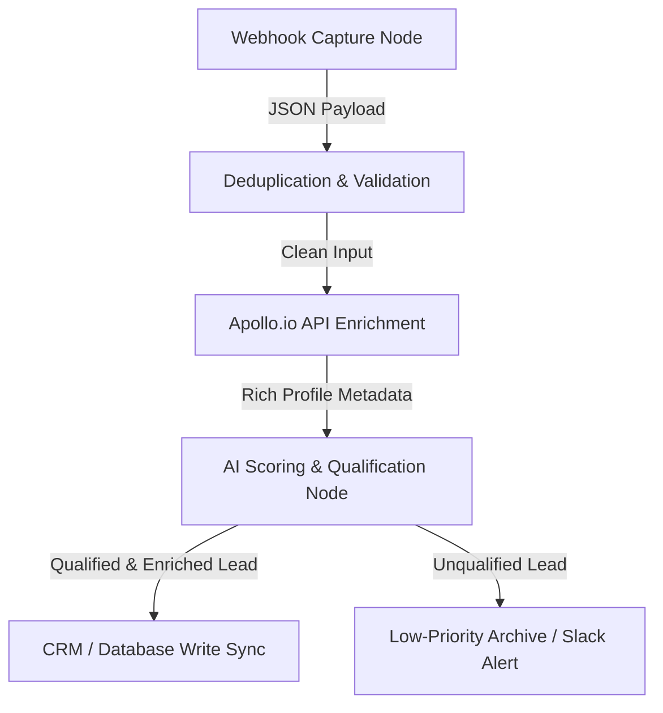

In modern outbound sales and marketing operations, **speed and data accuracy are the ultimate growth multipliers**. Manual prospecting, unstructured scraping, and dirty lead sheets are the silent killers of SaaS GTM pipelines. If your sales representatives are spending hours manually searching for phone numbers, copying LinkedIn profiles, or trying to qualify leads one by one, your customer acquisition cost (CAC) is bleeding.

To win in high-velocity markets, hyper-growing teams build **autonomous data enrichment pipelines**. 

By combining the workflow orchestration power of **n8n** with the massive B2B database of the **Apollo.io API** and the cognitive intelligence of an LLM, you can construct a self-healing outbound machine that operates 24/7. This article provides a comprehensive, step-by-step production blueprint to building a production-grade lead enrichment pipeline in under two hours.

---

## <mark>The Silent Bottleneck: Why Manual Lead Enrichment Fails at Scale</mark>

Most marketing and revenue operations suffer from a massive latency gap. When a visitor fills out a contact form or triggers an intent beacon, the lead is often routed to a database with nothing but an email address and a name. Before a sales development representative (SDR) can write a personalized outbound message, they must manually enrich the contact:

1. Search for the company domain on Google.
2. Look up the contact's LinkedIn profile to verify their title.
3. Cross-reference their corporate tech stack.
4. Estimate company headcount, funding stage, and industry verticals.

This manual loop takes anywhere from **10 to 20 minutes per lead**. If your campaign generates 500 leads a day, you are burning over 80 hours of manual labor per week on raw data entry. 

Furthermore, data quality decays quickly. Over 30% of B2B professionals change roles, company names, or email domains annually. Static databases decay faster than they can be populated.

An automated pipeline solves this latency by executing **instant, programmatic API lookups** at the exact millisecond a lead is captured. By enriching the data immediately, your systems can score, route, and personalize outreach asynchronously—allowing your SDRs to focus solely on high-value conversations.

---

## <mark>The Lead Enrichment Pipeline Architecture</mark>

To ensure reliability, scalability, and performance, our pipeline is designed around a **five-stage decoupled architecture**. 

Instead of building a single, fragile monolithic script, we split the workflow into discrete modules. This makes troubleshooting, rate-limit management, and scaling simple.



### The 5-Stage Decoupled Workflow:

* **Stage 1: Webhook Capture Node:** A public HTTP endpoint listening for inbound payloads from lead forms, ads, or chatbot hooks.
* **Stage 2: Validation & Deduplication:** Pre-flight checks inside n8n to verify that the payload contains a valid email address and to check if the lead already exists in your CRM, preventing duplicate API costs.
* **Stage 3: Apollo.io API Enrichment:** A dynamic HTTP request to Apollo’s **People Enrichment API**, returning direct phone numbers, LinkedIn URLs, company revenue, funding history, and exact employee headcount.
* **Stage 4: AI Lead Scoring (LLM Node):** Sending the enriched profile metadata to a localized LLM prompt to grade the lead (A, B, C, D) based on Ideal Customer Profile (ICP) parameters.
* **Stage 5: CRM Sync & Notification:** Pushing qualified leads directly into your sales CRM (e.g., Brevo or HubSpot) and alerting your sales team on Slack with a rich markdown profile summary.

---

## <mark>Step-by-Step Pipeline Implementation Guide</mark>

Below is the step-by-step implementation guide to configuring each node inside your n8n workflow.

### Step 1: Configuring the Inbound Webhook

The pipeline starts with an **n8n Webhook Node**. This node acts as the secure entry point. 

To keep the pipeline robust, set the **HTTP Method** to `POST` and ensure the **Response Mode** is set to `Immediately`. Returning a immediate `200 OK` status ensures that upstream webhook providers (like Webflow, Typeform, or Facebook Lead Ads) do not timeout while the pipeline is processing downstream API calls.

```json
{
  "name": "Webhook Lead Ingest",
  "parameters": {
    "httpMethod": "POST",
    "path": "lead-enrichment-ingest",
    "responseMode": "responseNode",
    "responseData": "allEntries"
  }
}
```

### Step 2: The Apollo.io API Enrichment Node

Once the webhook receives a valid payload, the email is extracted. We use a **Custom HTTP Request Node** in n8n to call the Apollo.io People Enrichment endpoint.

#### API Endpoint Specifications:
* **Endpoint URL:** `https://api.apollo.io/v1/people/match`
* **HTTP Method:** `POST`
* **Headers:**
  * `Content-Type: application/json`
  * `Cache-Control: no-cache`
* **JSON Request Body:**
  ```json
  {
    "api_key": "YOUR_APOLLO_API_KEY",
    "email": "={{ $json.body.email }}",
    "reveal_personal_emails": true,
    "reveal_phone_number": true
  }
  ```

This request returns a highly descriptive JSON object containing the contact’s title, department, company description, annual revenue, estimated employee count, tech stack, and location.

### Step 3: Writing the AI Lead Qualification Node

Raw data is useful, but it requires human cognitive processing to interpret. To automate this step, we feed the Apollo.io payload into an **n8n Basic AI Agent** or **OpenAI/Anthropic Chat Node**.

We write a strict prompt instructing the model to act as an automated RevOps qualification engine. The model evaluates the lead based on your custom ICP parameters:

#### The Advanced Qualification System Prompt:
```text
You are a high-performance RevOps lead qualification assistant. 
Analyze the following company and contact metadata provided by our enrichment engine:

Contact Title: {{ $json.person.title }}
Company Description: {{ $json.person.organization.description }}
Company Headcount: {{ $json.person.organization.estimated_num_employees }}
Company Annual Revenue: {{ $json.person.organization.annual_revenue }}
Target ICP Criteria:
- Ideal industries: SaaS, AI/ML, Logistics, B2B Agencies
- Preferred Job Titles: Founder, CEO, VP of Sales, CTO, CMO, RevOps Director
- Headcount range: 10 to 250 employees

Evaluate the data. Output a raw JSON object containing exactly three keys:
1. "score": A numeric value from 0 to 100 indicating ICP alignment.
2. "grade": A string value ("A", "B", "C", "D") representing lead tier.
3. "summary": A concise 2-sentence summary explaining why the lead was graded this way.

Format your output ONLY as valid JSON. Do not include markdown code blocks or explanations outside the JSON object.
```

By grading the lead programmatically, you can automatically separate high-ticket enterprise targets from low-value test submissions.

### Step 4: Routing and CRM Synchronization

Following the AI node, use an **n8n Router Node** or **If Node** to evaluate the grade:

* **If Grade is A or B (Qualified):** Route the lead directly to your primary CRM (e.g. Brevo) using the Brevo API, add them to your outbound sales sequence, and send a rich interactive message to your SDR Slack channel.
* **If Grade is C or D (Unqualified):** Route the lead to an internal archival database or add them to a low-frequency marketing nurture list.

Here is the HTML layout representing our lead score routing framework:

<table class="w-full text-left border-collapse border border-slate-700 my-6">
  <thead>
    <tr class="bg-slate-800 text-slate-200">
      <th class="p-3 border border-slate-700 font-semibold">Lead Grade</th>
      <th class="p-3 border border-slate-700 font-semibold">ICP Alignment</th>
      <th class="p-3 border border-slate-700 font-semibold">Automated GTM Action</th>
    </tr>
  </thead>
  <tbody>
    <tr class="border-b border-slate-700 bg-slate-900/50">
      <td class="p-3 border border-slate-700 text-emerald-400 font-bold">Grade A</td>
      <td class="p-3 border border-slate-700">Perfect Match (Target Roles + SaaS/AI Tier)</td>
      <td class="p-3 border border-slate-700">Sync CRM + Alert Slack + Trigger High-Value Sequence</td>
    </tr>
    <tr class="border-b border-slate-700 bg-slate-900/30">
      <td class="p-3 border border-slate-700 text-cyan-400 font-semibold">Grade B</td>
      <td class="p-3 border border-slate-700">Strong Match (Middle Management + B2B Scale)</td>
      <td class="p-3 border border-slate-700">Sync CRM + Add to SDR Manual Tasks Queue</td>
    </tr>
    <tr class="border-b border-slate-700 bg-slate-900/10">
      <td class="p-3 border border-slate-700 text-amber-500 font-medium">Grade C</td>
      <td class="p-3 border border-slate-700">Low Alignment (Non-Target Roles / Tech Stack mismatch)</td>
      <td class="p-3 border border-slate-700">Add to Weekly Email Newsletter Nurture Sequence</td>
    </tr>
    <tr class="bg-slate-900/50">
      <td class="p-3 border border-slate-700 text-rose-500 font-medium">Grade D</td>
      <td class="p-3 border border-slate-700">No Alignment (Students, Personal Emails, Junk data)</td>
      <td class="p-3 border border-slate-700">Archive lead automatically. Prevent CRM clutter.</td>
    </tr>
  </tbody>
</table>

---

## <mark>How to Beat the Webhook Timeout: The Async Callback Blueprint</mark>

One of the most common RevOps architecture failures is the **upstream timeout**. 

Most form builders, webhook relays, and landing pages enforce a strict response timeout window of **10 seconds**. If your pipeline makes multiple synchronous API lookups (e.g. validating email → querying Apollo → prompting OpenAI → pushing to CRM), the entire flow can easily exceed 12 seconds. When this happens, the upstream form provider aborts the webhook request, resulting in lost leads and broken telemetry.

To solve this, you must construct an **Asynchronous Callback Queue Architecture**.

Instead of holding the webhook open while n8n executes the enrichment nodes, split the workflow into **two separate, decoupled systems** bridged by a queue manager:

1. **The Ingestion Workflow:** Webhook captures lead details, immediately pushes the raw payload into a message broker or an internal n8n database, and returns a fast `200 OK` response to the form builder in under **150 milliseconds**.
2. **The Processing Workflow:** A secondary cron-triggered or event-driven workflow that pulls the raw payloads from the queue, runs all API calls, prompts the LLM, and updates the CRM asynchronously.

This asynchronous model ensures your primary lead forms never fail, regardless of API response latencies.

---

## <mark>Self-Healing Error Handling: Designing for 99.9% Pipeline Uptime</mark>

APIs fail. Apollo.io may experience minor rate limits, your OpenAI API key might temporarily hit token ceilings, or HubSpot's servers could go down. If you do not design for failure, a single API error will kill the entire execution, dropping the lead completely.

To build a self-healing pipeline inside n8n:

* **Use "Retry On Failure" node parameters:** On both the Apollo.io and AI qualification nodes, open the node settings, enable the **Retry On Failure** toggle, set the **Max Retries** to `3`, and set the **Retry Interval** to `60` seconds with an exponential backoff.
* **Inject Try-Catch Code Nodes:** Wrap custom JavaScript calculations in robust `try...catch` loops to prevent execution crashes.
* **Establish a Dead-Letter Queue (DLQ):** Connect the error output of every node to an n8n Error Trigger. If a node fails after 3 retries, the error trigger catches the execution data, saves the raw lead payload to a Google Sheet or database, and sends an urgent Slack message to your RevOps team with the failed node name and error log.

---

## <mark>Verification: Pipeline Performance Benchmarks</mark>

To verify that your newly deployed lead enrichment pipeline is functioning optimally, audit the system using these three performance telemetry metrics:

* **Enrichment Match Rate:** The percentage of inbound email addresses that successfully return company and profile data from Apollo.io. Target: **> 78% for B2B domains**.
* **E2E Pipeline Latency:** The total execution time from webhook ingest to CRM write. With our asynchronous queue architecture, the user-facing latency must remain **< 200ms**, and the backend enrichment must complete **< 30 seconds**.
* **AI Scoring Accuracy:** Run a manual audit on a batch of 100 leads once a month to compare AI grades against human grades. The AI classification should match human experts with **> 92% precision**.

Deploy this automation stack today, eliminate manual outbound bottleneck, and let your revenue operations run on autopilot!
